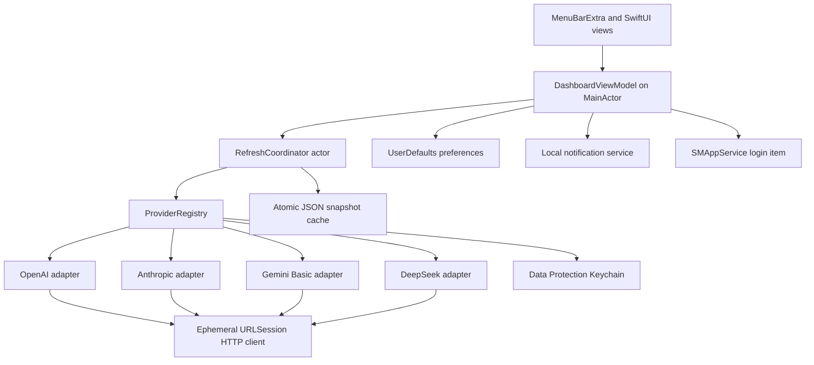
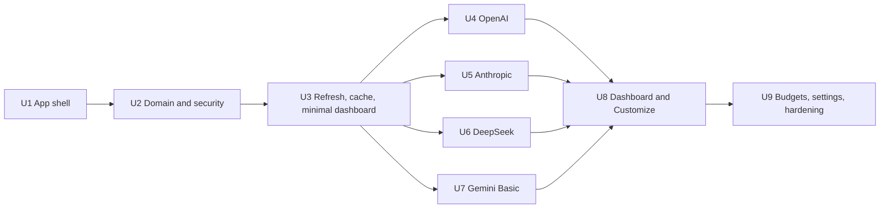

# LLM API Spend Monitor - Plan

## Goal Capsule

- **Objective:** создать local-first menu bar-приложение для macOS, которое объединяет официально доступные сведения об API-расходах OpenAI, Anthropic, Gemini и DeepSeek без проксирования LLM-запросов.
- **Authority order:** подтверждённый пользовательский scope → официальная документация провайдеров и Apple → решения этого плана → референсные UX-паттерны OpenUsage.
- **Execution profile:** нативное SwiftUI-приложение для macOS 14+, один локальный процесс, без backend, облачного аккаунта и сторонней аналитики.
- **Stop conditions:** не использовать private/undocumented endpoints, scraping dashboard-страниц или ложные оценки баланса; не сохранять секреты вне Keychain; не объединять в один total несопоставимые метрики; не начинать U1, пока preflight не подтвердит полный Xcode toolchain.
- **Tail ownership:** реализация должна пройти все проверки из Verification Contract; план остаётся решающим артефактом и не используется как трекер прогресса.

---

## Product Contract

### Summary

План создаёт компактный монитор расходов в стиле нативной macOS utility: одна метрика в menu bar, раскрывающаяся панель со сводкой, capability-based карточками четырёх провайдеров, сортировкой, безопасным подключением credentials и честной маркировкой источника данных.

### Problem Frame

Пользователь вынужден открывать разные billing dashboards, чтобы проверить расход API, токены и доступные средства. Провайдеры дают разные программные возможности: OpenAI и Anthropic предоставляют usage/cost reports только через административные ключи, DeepSeek возвращает текущий баланс по обычному API key, а Gemini не предоставляет документированный balance/cost endpoint для обычного ключа. Продукт должен объединить доступные сведения, не создавая ложного ощущения одинаковой полноты данных.

OpenUsage является UX-референсом для menu bar, popover, hover details, provider cards и drag reorder, но продукт не копирует его подписочные лимиты, auto-discovery, локальный HTTP API или широкий набор настроек.

### Actors

- A1. Владелец Mac и API-аккаунтов, который подключает свои credentials и следит за личными расходами.
- A2. LLM-провайдер, который определяет доступные метрики, права ключа, задержку обновления и формат ошибок.
- A3. macOS, которая обеспечивает Keychain, menu bar lifecycle, локальные уведомления и launch at login.

### Requirements

#### Core monitoring

- R1. Приложение работает как нативная menu bar utility на macOS 14+ без постоянной иконки в Dock.
- R2. MVP содержит OpenAI, Anthropic, Gemini и DeepSeek и рендерит каждый provider по его объявленным capabilities, а не по единой обязательной схеме.
- R3. OpenAI показывает официальный cost для Today, Yesterday и 30 Days по всем Cost API line items, а также text-generation token/model breakdown из Completions Usage, полученные через Organization Admin API key.
- R4. Anthropic показывает официальный cost для Today, Yesterday и 30 Days, usage и model breakdown, полученные через Console Admin API key.
- R5. DeepSeek показывает официальный текущий баланс, доступность средств и разделение granted/top-up по возвращаемым валютам; история расходов и model breakdown не имитируются.
- R6. Gemini Basic проверяет сохранённый API key документированным безгенерационным запросом, показывает состояние подключения и даёт ссылки на Usage, Billing и Status; отсутствие programmatic balance/cost обозначается прямо в карточке.
- R7. Общий spend и круговая диаграмма включают только сопоставимые complete official cost series с общим reporting horizon; balance, user budget, lagging/partial series и недоступные данные не суммируются со spend. При неполном покрытии UI показывает Partial вместо authoritative total.
- R8. Для каждого числового значения отображается provenance: `Official`, `User budget` или `Unavailable`; `Estimated` зарезервирован для будущих функций и в MVP не создаётся.
- R9. Пользователь видит время последнего успешного обновления, состояние refresh, stale/offline/auth/rate-limit ошибки и последние успешные значения; результат пользовательского Test/manual refresh доступно объявляется VoiceOver, а фоновые refresh не создают announcements.

#### Interaction and customization

- R10. Menu bar показывает одну выбранную краткую метрику: общий official spend за сегодня, остаток пользовательского бюджета в процентах или capability-backed метрику выбранного provider.
- R11. Раскрывающаяся панель содержит период Today/Yesterday/30 Days, агрегированную сводку, карточки providers, compact trend и типизированные внешние ссылки Usage/Billing/Dashboard/Status, доступные конкретному provider.
- R12. Пользователь может включать, скрывать и менять порядок providers через отдельный Customize view; порядок сохраняется после перезапуска.
- R13. Drag reorder имеет клавиатурную альтернативу Move Up/Move Down; строка сообщает позицию, граничные действия disabled, после перемещения focus остаётся на том же provider, а важная информация не доступна только через hover.
- R14. Интерфейс поддерживает system light/dark mode, VoiceOver, keyboard navigation, increased contrast и reduced motion/transparency без отдельных тем и density presets; asynchronous user-initiated status, auth/error and destructive actions имеют доступные announcements and recovery controls.

#### Credentials and privacy

- R15. Onboarding объясняет требуемый credential: OpenAI Organization Admin key, Anthropic Console Admin key, Gemini API key и DeepSeek API key.
- R16. Credentials сохраняются только в macOS Data Protection Keychain, не синхронизируются через iCloud и никогда не попадают в UserDefaults, cache, логи или уведомления.
- R17. Приложение обращается напрямую к официальным HTTPS API providers и не запускает backend, proxy, gateway или входящий локальный сервер.
- R18. Удаление provider credential не удаляет настройки порядка и пользовательского бюджета, но очищает его cached sensitive-adjacent state после подтверждения.

#### Refresh, budgets, and settings

- R19. Приложение обновляет stale данные при открытии панели, поддерживает manual refresh и, когда periodic refresh включён, выполняет best-effort polling раз в пять минут, не называя его real-time.
- R20. Refresh выполняется независимо по providers, объединяет одновременные triggers, уважает `Retry-After`, применяет exponential backoff with jitter и не очищает last-known-good data при ошибке.
- R21. Пользователь может задать отдельный месячный budget только для provider с полной official cost history; `budget left` вычисляется из official cost и не называется provider balance.
- R22. Локальные уведомления поддерживают budget thresholds 80% и 100%; DeepSeek low-balance alert срабатывает при переходе ниже пользовательского threshold отдельно для каждой валюты и повторно разрешается только после восстановления выше threshold.
- R23. Минимальные настройки включают launch at login, выбор menu bar metric, refresh enablement, budgets и notifications; advanced appearance, global shortcut и telemetry отсутствуют.

### Key Flows

- F1. **First connection**
  - **Trigger:** пользователь впервые открывает приложение.
  - **Actors:** A1, A2, A3.
  - **Steps:** при первом запуске menu panel автоматически раскрывается с focus на onboarding heading и действием Connect Provider; пользователь может Close/Skip и вернуться через Options → Connections; после сохранения первого credential приложение завершает onboarding, проверяет доступ, сохраняет секрет в Keychain и выполняет первый refresh.
  - **Outcome:** provider получает состояние Connected, Limited или Error без раскрытия ключа.
  - **Covered by:** R2, R5, R6, R15, R16.
- F2. **Routine check**
  - **Trigger:** пользователь нажимает menu bar item.
  - **Actors:** A1, A2.
  - **Steps:** панель мгновенно показывает cache, обновляет stale providers, отображает official totals и capability-specific cards.
  - **Outcome:** пользователь понимает расходы и свежесть данных без посещения нескольких dashboards.
  - **Covered by:** R3-R11, R19-R20.
- F3. **Customize providers**
  - **Trigger:** пользователь открывает Customize.
  - **Actors:** A1.
  - **Steps:** пользователь скрывает provider или меняет порядок drag-and-drop либо кнопками Move Up/Down.
  - **Outcome:** menu bar panel отражает новый порядок после перезапуска.
  - **Covered by:** R12-R14.
- F4. **Provider failure**
  - **Trigger:** credential отозван, API отвечает 429/5xx, Mac offline или данные malformed.
  - **Actors:** A2, A3.
  - **Steps:** refresh coordinator классифицирует ошибку, сохраняет last-known-good snapshot и продолжает обновление остальных providers.
  - **Outcome:** одна интеграция не ломает общий dashboard, stale data явно помечены.
  - **Covered by:** R9, R20.

### Acceptance Examples

- AE1. **Given** подключены OpenAI и Anthropic, **when** пользователь выбирает Today, **then** общий total равен сумме official Cost API values, а tokens не используются для пересчёта денег.
- AE2. **Given** подключён DeepSeek, **when** `/user/balance` возвращает USD и CNY entries, **then** они показываются раздельно и не конвертируются в общий USD total.
- AE3. **Given** подключён Gemini API key, **when** key validation успешна, **then** карточка показывает Connected и ссылки, но не показывает выдуманный spend или balance.
- AE4. **Given** Anthropic key не является Admin key, **when** выполняется refresh, **then** карточка объясняет недостаточные права, а OpenAI, Gemini и DeepSeek продолжают обновляться.
- AE5. **Given** сохранённый snapshot старше двух refresh cycles, **when** новый fetch падает, **then** старые значения остаются видимыми с меткой Outdated и точным временем последнего успеха.
- AE6. **Given** provider скрыт и перемещён, **when** приложение перезапущено, **then** видимость и порядок сохраняются, а Keychain credential не меняется.
- AE7. **Given** budget threshold уже вызвал уведомление, **when** повторный refresh возвращает тот же период и диапазон, **then** второе уведомление не отправляется.
- AE8. **Given** пользователь работает только с клавиатурой и VoiceOver, **when** он открывает panel и Customize, **then** все ключевые значения, ссылки и reorder actions доступны без hover и drag.

### Success Criteria

- Четыре provider cards существуют и честно отражают различия официальных API.
- OpenAI и Anthropic дают воспроизводимые official spend totals и token/model breakdown на fixture и live smoke accounts.
- DeepSeek показывает официальный баланс, Gemini — явно ограниченный Basic mode без scraping.
- Ни один credential не обнаруживается в локальных preferences, cache, logs и test artifacts.
- Открытие панели показывает cache без ожидания сети; один упавший provider не блокирует остальные.
- Полный keyboard и VoiceOver smoke проходит для menu bar panel и Customize.

### Scope Boundaries

#### Deferred to Follow-Up Work

- Gemini Advanced: Google OAuth, project selection, Cloud Monitoring usage и опциональный BigQuery Billing Export.
- Multiple accounts per provider, team workspaces и shared dashboards.
- Signed/notarized public beta, Homebrew cask, Sparkle update channel и App Store distribution.
- Локальная долгосрочная аналитика, forecasts, валютный FX conversion и versioned pricing catalog.
- Дополнительные providers и импорт usage CSV.

#### Outside This Product's Identity

- Мониторинг ChatGPT Plus, Claude Pro/Max, Cursor и других subscription quotas.
- Проксирование LLM traffic, AI Gateway, prompt logging или перехват чужих requests.
- Scraping dashboards, чтение browser cookies и private provider endpoints.
- Cloud account/sync, web dashboard, mobile clients и серверная телеметрия.
- Auto-discovery локальных AI tools, local HTTP API, share snapshot и global shortcut.

---

## Planning Contract

### Product Contract Preservation

Product Contract changed: provider count expanded from three to four after user confirmation; DeepSeek added. Research-derived capability limits for Gemini and DeepSeek clarify, but do not remove, the confirmed providers.

### Key Technical Decisions

- KTD1. **Native SwiftUI on macOS 14+.** Use an Xcode macOS app target, Swift 6 concurrency checking and only Apple frameworks in MVP. macOS 14 enables Swift Charts `SectorMark` and modern menu bar APIs while avoiding macOS 15-only adoption friction.
- KTD2. **SwiftUI menu shell first.** Use `MenuBarExtra` with `.menuBarExtraStyle(.window)` and `LSUIElement=true`. U1 includes a focus/keyboard spike; only if acceptance tests fail, replace the shell with a minimal AppKit `NSStatusItem` plus key-capable `NSPanel`, keeping all feature views in SwiftUI.
- KTD3. **Capability-driven provider contract.** Each adapter declares supported metrics and freshness; the UI renders available values instead of branching on provider names or forcing fake parity.
- KTD4. **Official cost is the financial source of truth.** OpenAI Costs and Anthropic Cost Report supply spend. Token pricing is not recomputed because discounts, service tiers and contract pricing can diverge. If Anthropic Usage contains Priority Tier in the selected period, its cost is marked incomplete and excluded from aggregate totals and budget alerts because the Cost Report omits that tier.
- KTD5. **No automatic money data for Gemini Basic.** An ordinary Gemini API key cannot access account spend or balance. The MVP validates the key and deep-links to official dashboards; OAuth/Monitoring/BigQuery is a separate feature.
- KTD6. **DeepSeek is balance-only.** The official balance endpoint is used directly. Balance deltas are not labeled as daily spend because top-ups, grants, expirations and refunds make that inference unreliable.
- KTD7. **Secrets in Data Protection Keychain.** Store one item per provider/account with `kSecUseDataProtectionKeychain=true`, `kSecAttrSynchronizable=false` and `WhenUnlockedThisDeviceOnly`. A locked Keychain creates a recoverable stale state; periodic refresh resumes after unlock rather than materializing admin keys while the Mac is unattended.
- KTD8. **Small local persistence, no database.** Use UserDefaults for non-secret preferences and an atomic Codable JSON cache under Application Support for normalized last-known snapshots and 30-day buckets. SwiftData is deferred until the product needs independent long-term queryable history.
- KTD9. **Actor-owned refresh.** A `RefreshCoordinator` actor coalesces triggers, limits concurrency, applies per-provider cooldown/backoff and publishes results to a `@MainActor` dashboard model.
- KTD10. **Exact monetary representation.** Parse currency values as `Decimal`, normalize provider-specific minor units into major currency units at the adapter boundary, and persist canonical decimal strings plus ISO currency codes; token counts use `Int64`. Never use `Double` for billing math.
- KTD11. **One account per provider.** This keeps Keychain identity, ordering and dashboard semantics small for the personal MVP; the provider/account key shape remains extensible.
- KTD12. **Direct personal distribution first.** MVP completion is a working local Release build. No updater dependency or notarization pipeline is introduced until the app is useful on the owner's Mac.
- KTD13. **Core proof before polish.** Reorder, charts, budgets, notifications and launch at login remain in the confirmed personal MVP, but U3 must first produce a usable generic dashboard with fake/provider snapshots so any adapter can deliver an end-to-end vertical slice independently.
- KTD14. **Validate the reporting contract before freezing it.** U2 begins with sanitized real OpenAI/Anthropic responses and dashboard reconciliation for money units, pagination, UTC boundaries, partial results and freshness metadata before finalizing `ProviderSnapshot` and cache schema.
- KTD15. **Incremental provider-specific polling.** The scheduler wakes at five-minute best effort, but providers enforce their own minimum cadence and request budgets: Anthropic and DeepSeek may refresh every five minutes, OpenAI no more often than every fifteen minutes, and Gemini Basic only on connect/manual test. Periodic fetches update mutable recent buckets; the trailing 30 days hydrate once per session or explicit full refresh.

### Provider Capability Matrix

| Provider | Credential | Official cost history | Token/model history | Official balance | MVP card |
|---|---|---:|---:|---:|---|
| OpenAI | Organization Admin API key | Yes, daily Costs | Yes, Usage buckets | No documented endpoint | Full spend card + Billing/Status links |
| Anthropic | Console Admin API key | Yes, daily Cost Report | Yes, Usage Report | No documented endpoint | Full spend card + Billing/Status links |
| DeepSeek | Standard API key | No documented endpoint | No account-history endpoint | Yes, `/user/balance` | Balance card + Usage/Billing/Status links |
| Gemini | Standard Gemini API key | No via ordinary key | No account history via ordinary key | No documented endpoint | Basic connection card + Usage/Billing/Status links |

### High-Level Technical Design

### Domain Model

- `ProviderID`: stable IDs `openai`, `anthropic`, `gemini`, `deepseek`.
- `ProviderCapability`: `officialCostHistory`, `tokenHistory`, `modelBreakdown`, `officialBalance` and a typed `externalLinks` collection with `usage`, `billing`, `dashboard` and `status` kinds.
- `Money`: `Decimal amount`, `String currency`, no implicit conversion.
- `MetricProvenance`: `official`, `userBudget`, `unavailable`; `estimated` reserved but unused.
- `PeriodBucket`: start/end in UTC plus provider-reported values. Today and Yesterday follow the providers' UTC reporting-day boundaries and the UI exposes that boundary in help text instead of silently re-bucketing daily costs into local time.
- `ProviderSnapshot`: capabilities, metrics, fetchedAt, provider reporting coverage (`coverageStart`, `coverageThrough`, completeness), source freshness, and optional typed error while retaining last success.
- `ProviderConfiguration`: enabled, sortOrder, selected menu metric, optional budget and low-balance threshold; no secret material.

### Security and Privacy Boundary

- App Sandbox permits only outbound network client access and framework-required local storage.
- Each provider metadata record owns a fixed HTTPS API origin; the HTTP client validates scheme, host and port before attaching a credential and rejects cross-origin redirects.
- `URLSessionConfiguration.ephemeral` prevents cookie and credential persistence; requests have bounded timeout and response-size limits.
- Logs contain provider ID, request ID where safe, status category and timing, but redact URLs with query secrets, headers, response bodies and currency/account identifiers.
- Usage/Billing/Dashboard/Status URLs are typed allowlisted constants owned by adapters; provider responses cannot supply arbitrary external links.
- Cache writes are atomic and exclude credentials, auth headers and raw API responses.
- Normalized cache is plaintext inside the sandbox, limited to the last 31 daily buckets plus current provider state, marked excluded from backup, and replaced on schema reset; no raw response history is retained.
- Key deletion is explicit; auth errors never delete a saved credential automatically.
- Credential mutation increments a per-provider generation. Deletion cancels active refresh, removes the Keychain item, purges cached provider data and rejects any late result from an older generation.

### Refresh and Caching Policy

- Load cache synchronously enough for first paint, then refresh providers whose in-session freshness exceeds five minutes.
- Opening panel, manual refresh, periodic timer and wake/network recovery all enter one coalescing coordinator.
- Refresh providers with bounded concurrency; each result commits independently.
- Periodic cycles fetch only the current and previous mutable UTC buckets, while older 30-day buckets hydrate once per session or explicit full refresh. Each provider cycle has a page/request cap; an unfinished cursor produces Partial coverage and resumes later instead of claiming a complete total.
- Hard automatic request budgets are OpenAI four requests per 15-minute cycle plus at most 20 for session hydration, Anthropic four requests per 5-minute cycle plus at most 20 for hydration, DeepSeek one request per 5-minute cycle, and Gemini zero periodic requests. Manual full refresh is user-initiated and separately visible; tests assert these ceilings.
- Aggregate totals use the intersection of complete provider reporting horizons. Lagging or paginated-incomplete series remain visible in their cards but are excluded from aggregate totals and budget alerts until coverage is complete.
- Respect server `Retry-After`; otherwise exponential backoff with jitter and a maximum cooldown.
- A disk snapshot is displayable at launch but never suppresses the first network refresh of the new session.
- Data older than ten minutes is Outdated; the UI shows exact last-success age and current error.
- A five-minute scheduler interval is not a uniform network cadence or freshness promise: OpenAI has no documented reporting latency and uses a fifteen-minute minimum, Anthropic usually updates within five minutes, DeepSeek publishes no balance SLA, and Gemini Basic has no periodic usage polling.
- A locked Keychain pauses credential-backed fetches and preserves the last snapshot as stale; open/manual/wake triggers retry after unlock.

### UX Composition

- Menu bar: app icon plus one concise selected metric, never four simultaneous provider percentages.
- Panel width: approximately 400–440 points, vertically scrollable, with pinned footer for refresh state and Options.
- Summary: period selector, official spend total, donut only when at least two comparable official cost series exist.
- Provider card: name, connection/capability badge, primary metrics, compact chart when history exists, last update/error, Dashboard and Status buttons.
- Customize: separate view with enabled toggles, drag handles, Move Up/Down accessibility actions and credential details.
- Settings: General, Menu Bar, Budgets & Alerts, Privacy/About; no visual-option matrix.

### Sequencing

### Assumptions

- Интерфейс приложения и plan naming могут быть уточнены позже; рабочее имя не является product decision.
- Один пользователь и один account на provider достаточны для personal MVP.
- USD и CNY отображаются раздельно; FX conversion отсутствует.
- Provider API behavior проверяется fixture tests и optional live smoke, но тесты CI не требуют реальных secrets.
- Public distribution не входит в MVP, поэтому Developer ID, notarization и Sparkle не блокируют Definition of Done.

### Risks and Mitigations

| Risk | Impact | Mitigation |
|---|---|---|
| Пользователь ожидает balance для всех providers | Недоверие к продукту | Capability matrix и явные labels; не использовать слово balance для budget left |
| Admin key имеет высокий уровень доступа | Утечка организации и billing metadata | Keychain-only storage, origin-bound HTTPS, zero-secret logging, delete/test controls |
| Reporting APIs меняют schema или pagination | Неполные или неверные totals | Typed decoders, fixture variants, unknown-field tolerance, pagination golden tests |
| OpenAI/DeepSeek freshness не документирована | «Live» цифры запаздывают | Last updated, Outdated state, manual refresh, отсутствие real-time claims |
| MenuBarExtra focus/keyboard limitations | Неудобный Customize flow | U1 acceptance spike и ограниченный AppKit fallback до построения остального UI |
| macOS App Nap/sleep throttles polling | Пропущенные интервалы | Best-effort semantics, refresh on open/wake, no daemon promise |
| Mixed currencies distort total | Неверный общий расход | Aggregate only same-currency official costs; no FX in MVP |
| DeepSeek key одновременно способен делать inference | Более высокий credential risk | Показывать предупреждение, не выполнять generation requests, позволять быстро удалить key |
| Gemini Basic выглядит слабее других cards | Низкая perceived value | Объяснить official limitation и дать one-click Usage/Billing links; Advanced integration отдельно |

### Research Sources

- OpenAI Administration/Usage/Costs: https://developers.openai.com/api/reference/administration/overview and https://developers.openai.com/api/reference/resources/admin/subresources/organization/subresources/usage
- OpenAI Usage Dashboard and prepaid billing: https://help.openai.com/en/articles/10478918-api-usage-dashboard and https://help.openai.com/en/articles/8264644
- Anthropic Usage and Cost API: https://platform.claude.com/docs/en/manage-claude/usage-cost-api
- Anthropic Admin keys: https://platform.claude.com/docs/en/manage-claude/admin-api-keys
- DeepSeek balance and FAQ: https://api-docs.deepseek.com/api/get-user-balance and https://api-docs.deepseek.com/faq
- Gemini billing and API keys: https://ai.google.dev/gemini-api/docs/billing and https://ai.google.dev/gemini-api/docs/api-key
- Gemini AI Studio permissions: https://ai.google.dev/gemini-api/docs/troubleshoot-ai-studio
- Apple MenuBarExtra, Keychain, networking and login item: https://developer.apple.com/documentation/swiftui/menubarextra, https://developer.apple.com/documentation/security/keychain-services, https://developer.apple.com/documentation/foundation/urlsession, https://developer.apple.com/documentation/servicemanagement/smappservice/mainapp
- OpenUsage product and architecture reference: https://www.openusage.ai/ and https://github.com/robinebers/openusage/blob/main/docs/architecture.md

---

## Implementation Units

### U1. Native app shell and menu bar lifecycle

- **Goal:** создать минимальный dockless macOS app shell и доказать жизнеспособность SwiftUI menu bar interaction до feature work.
- **Requirements:** R1, R10, R11, R14.
- **Files:** `.gitignore`, `LLMSpendMonitor.xcodeproj/project.pbxproj`, `LLMSpendMonitor/App/LLMSpendMonitorApp.swift`, `LLMSpendMonitor/App/AppState.swift`, `LLMSpendMonitor/UI/MenuBar/MenuBarLabelView.swift`, `LLMSpendMonitor/UI/Dashboard/DashboardRootView.swift`, `LLMSpendMonitor/Info.plist`, `LLMSpendMonitor/LLMSpendMonitor.entitlements`, `LLMSpendMonitorTests/App/MenuBarShellTests.swift`, `LLMSpendMonitorUITests/MenuBarLifecycleUITests.swift`.
- **Approach:** preflight confirms a full Xcode toolchain before creating files. Then create the macOS app target, shared scheme, `MenuBarExtra` window style, Settings scene and application-agent configuration. Проверить focus, outside-click, keyboard navigation, singleton settings and quit behavior. Если тесты focus/key handling не проходят, в этой же unit заменить только shell на `NSStatusItem` + key-capable `NSPanel`.
- **Test Scenarios:** Xcode preflight fails with an actionable message when only CommandLineTools are active; first launch without Dock icon auto-opens onboarding panel with heading focus; Close/Skip and Options → Connections restore the flow; menu item click opens/closes panel; outside click; Settings singleton; Quit; relaunch without duplicate status items or repeated onboarding after first connection.
- **Verification:** pass the Xcode preflight, build app target and run `MenuBarLifecycleUITests` on macOS 14+.
- **Dependencies:** none.

### U2. Provider domain, secure credentials, and connection management

- **Goal:** определить stable provider contract и безопасный credential lifecycle для четырёх providers.
- **Requirements:** R2, R8, R15-R18.
- **Files:** `docs/research/provider-contract-validation.md`, `LLMSpendMonitor/Domain/ProviderID.swift`, `LLMSpendMonitor/Domain/ProviderCapability.swift`, `LLMSpendMonitor/Domain/ExternalLink.swift`, `LLMSpendMonitor/Domain/Money.swift`, `LLMSpendMonitor/Domain/ProviderSnapshot.swift`, `LLMSpendMonitor/Providers/ProviderClient.swift`, `LLMSpendMonitor/Providers/ProviderRegistry.swift`, `LLMSpendMonitor/Infrastructure/Security/KeychainStore.swift`, `LLMSpendMonitor/Features/Connections/ConnectionViewModel.swift`, `LLMSpendMonitor/UI/Connections/ProviderConnectionView.swift`, `LLMSpendMonitorTests/Domain/MoneyTests.swift`, `LLMSpendMonitorTests/Providers/ProviderRegistryTests.swift`, `LLMSpendMonitorTests/Infrastructure/KeychainStoreTests.swift`, `LLMSpendMonitorTests/Security/SecretLeakRegressionTests.swift`, `LLMSpendMonitorTests/Fixtures/Contract/OpenAI/`, `LLMSpendMonitorTests/Fixtures/Contract/Anthropic/`, `LLMSpendMonitorUITests/ConnectionFlowUITests.swift`.
- **Approach:** first reconcile sanitized real OpenAI/Anthropic reports with their official dashboards and record money units, pagination, UTC boundaries, completeness and freshness metadata. Then finalize capability metadata, typed external links, errors and provenance. Keychain CRUD uses provider/account identity and injectable Security wrapper. UI masks secret, explains key type, supports Test, Replace and Delete. Credential deletion emits a generation invalidation that U3 consumes before cache purge.
- **Test Scenarios:** sanitized contract samples prove OpenAI major units, Anthropic minor-to-major conversion, pagination and partial coverage before domain types freeze; save/read/update/delete for each provider; duplicate save replaces only matching provider; missing/locked Keychain is recoverable and pauses refresh until unlock; invalid credential remains editable; Test success/failure and destructive delete announce a concise result while focus stays on the initiating control; deterministic canary secret is absent from encoded configuration, logs, error descriptions, URLs, accessibility labels and test attachments; delete increments provider generation after confirmation.
- **Verification:** unit tests with isolated Keychain service namespace plus UI connection smoke.
- **Dependencies:** U1.

### U3. Networking, refresh coordination, local cache, and minimal dashboard

- **Goal:** создать provider-independent data pipeline and the first usable capability-based dashboard before any real adapter is added.
- **Requirements:** R9, R19-R20.
- **Files:** `LLMSpendMonitor/Infrastructure/Networking/HTTPClient.swift`, `LLMSpendMonitor/Infrastructure/Networking/URLSessionHTTPClient.swift`, `LLMSpendMonitor/Infrastructure/Persistence/SnapshotCache.swift`, `LLMSpendMonitor/Infrastructure/Persistence/PreferencesStore.swift`, `LLMSpendMonitor/Services/RefreshCoordinator.swift`, `LLMSpendMonitor/Services/RefreshTrigger.swift`, `LLMSpendMonitor/Features/Dashboard/DashboardViewModel.swift`, `LLMSpendMonitor/UI/Providers/ProviderCard.swift`, `LLMSpendMonitor/UI/Providers/MetricRow.swift`, `LLMSpendMonitorTests/Infrastructure/HTTPClientTests.swift`, `LLMSpendMonitorTests/Infrastructure/SnapshotCacheTests.swift`, `LLMSpendMonitorTests/Services/RefreshCoordinatorTests.swift`, `LLMSpendMonitorUITests/DashboardCoreUITests.swift`.
- **Approach:** use ephemeral URLSession behind protocol; enforce provider HTTPS origins and reject cross-origin redirects; coalesce simultaneous triggers in an actor; provider tasks commit independently only when their credential generation is current; persist only normalized snapshots with atomic replacement and backup exclusion; model typed auth/rate-limit/server/offline/decoding failures. Render fake snapshots in a minimal generic card list so each later provider unit ends as a visible vertical slice.
- **Test Scenarios:** fake asymmetric provider cards render without provider-name branches; launch cache displayed then refreshed; open/manual/timer triggers coalesce; provider-specific cadence prevents OpenAI from refreshing at five-minute wakes and prevents Gemini periodic calls; recent-bucket refresh does not repaginate immutable 30-day history; request/page cap marks and resumes Partial coverage; one provider timeout does not block three others; 429 respects `Retry-After`; backoff has bounded jitter; 5xx/malformed JSON keeps last good values; disk cache never suppresses first session fetch; sleep/wake and unlock refresh stale data; atomic-write interruption preserves previous file; credential deletion cancels and purges, and a delayed old-generation response cannot recreate cache; redirect to another origin is rejected before credentials are attached.
- **Verification:** deterministic fake clock, URL protocol stubs and filesystem tests; no live network required.
- **Dependencies:** U2.

### U4. OpenAI official usage and cost adapter

- **Goal:** deliver financially authoritative OpenAI spend plus token/model detail from documented organization reports.
- **Requirements:** R3, R7-R9, R15, R20-R21.
- **Files:** `LLMSpendMonitor/Providers/OpenAI/OpenAIProvider.swift`, `LLMSpendMonitorTests/Providers/OpenAI/OpenAIProviderTests.swift`, `LLMSpendMonitorTests/Fixtures/OpenAI/usage-page.json`, `LLMSpendMonitorTests/Fixtures/OpenAI/costs-page.json`, `LLMSpendMonitorTests/Fixtures/OpenAI/error.json`.
- **Approach:** fetch `/v1/organization/costs` for all-line-item money totals and `/v1/organization/usage/completions` only for text-generation token/model breakdown; follow cursor pagination; group UTC reporting days into Today/Yesterday/30 Days without recomputing cost from token pricing; expose typed usage/billing/dashboard/status links. Other OpenAI usage families are deferred.
- **Test Scenarios:** empty organization; multi-page result; multiple projects/models; cached/batch completion tokens; UTC day boundary; fractional amounts; unknown cost line items; non-completion line items affect money total but not text-token breakdown; ordinary project key gets insufficient-permission error; partial usage success with cost failure does not publish a false total.
- **Verification:** fixture-driven adapter tests, visible OpenAI card through U3's generic dashboard, and optional manual live smoke with a disposable Admin key.
- **Dependencies:** U3.

### U5. Anthropic official usage and cost adapter

- **Goal:** deliver official Anthropic spend and token/model detail using Console Admin reporting APIs.
- **Requirements:** R4, R7-R9, R15, R20-R21.
- **Files:** `LLMSpendMonitor/Providers/Anthropic/AnthropicProvider.swift`, `LLMSpendMonitorTests/Providers/Anthropic/AnthropicProviderTests.swift`, `LLMSpendMonitorTests/Fixtures/Anthropic/usage-page.json`, `LLMSpendMonitorTests/Fixtures/Anthropic/cost-page.json`, `LLMSpendMonitorTests/Fixtures/Anthropic/error.json`.
- **Approach:** fetch daily Cost Report for spend and Messages Usage Report for tokens/models; parse cost `amount` as Decimal minor USD units and divide by 100 before creating domain `Money` in major units; paginate through `next_page`; keep reporting freshness separate from fetch time. If Usage reports Priority Tier in the selected period, publish an incomplete-cost state and exclude that provider from aggregate totals and budgets.
- **Test Scenarios:** empty report; multi-page 31-day report; cache creation/read tokens; service tiers and tool costs; API `"123.45"` maps to USD `1.2345`; 5-minute reporting lag; non-admin key; individual account unsupported; Priority Tier fixture marks cost incomplete and excludes it from aggregation and alerts.
- **Verification:** fixture-driven adapter tests, visible Anthropic card through U3's generic dashboard, and optional live smoke with Console Admin key.
- **Dependencies:** U3.

### U6. DeepSeek official balance adapter

- **Goal:** show current official DeepSeek funds without fabricating spend history.
- **Requirements:** R5, R7-R9, R15, R20, R22.
- **Files:** `LLMSpendMonitor/Providers/DeepSeek/DeepSeekProvider.swift`, `LLMSpendMonitorTests/Providers/DeepSeek/DeepSeekProviderTests.swift`, `LLMSpendMonitorTests/Fixtures/DeepSeek/balance.json`, `LLMSpendMonitorTests/Fixtures/DeepSeek/multi-currency-balance.json`.
- **Approach:** call only documented `/user/balance`, parse decimal string balances, keep currencies separate, expose official balance capability and dashboard/status links. Do not compute daily spend from balance deltas.
- **Test Scenarios:** USD only; CNY only; both currencies; granted vs topped-up; insufficient balance; 401/402/429; malformed decimal; top-up between refreshes changes balance but does not create spend history.
- **Verification:** fixture-driven tests, visible DeepSeek card through U3's generic dashboard, and optional live balance smoke.
- **Dependencies:** U3.

### U7. Gemini Basic capability-limited adapter

- **Goal:** include Gemini honestly without scraping or adding Google OAuth/BigQuery complexity to the personal MVP.
- **Requirements:** R6-R9, R15, R20.
- **Files:** `LLMSpendMonitor/Providers/Gemini/GeminiProvider.swift`, `LLMSpendMonitorTests/Providers/Gemini/GeminiProviderTests.swift`, `LLMSpendMonitorTests/Fixtures/Gemini/models.json`, `LLMSpendMonitorTests/Fixtures/Gemini/error.json`.
- **Approach:** validate API key through the documented Models listing operation, return connection status plus explicit unavailable cost/balance capabilities, and provide fixed AI Studio Usage/Billing/Status links.
- **Test Scenarios:** valid key with model list; invalid/restricted key; service disabled; empty model list; network failure retains previous Connected state as stale; no code path creates money or token totals from the validation response.
- **Verification:** fixture-driven adapter tests, visible Gemini Basic card through U3's generic dashboard, and optional no-generation live key smoke.
- **Dependencies:** U3.

### U8. Dashboard, charts, cards, and provider customization

- **Goal:** implement the polished OpenUsage-inspired interaction surface around normalized capabilities.
- **Requirements:** R7-R14.
- **Files:** `LLMSpendMonitor/UI/Dashboard/SummaryCard.swift`, `LLMSpendMonitor/UI/Dashboard/PeriodPicker.swift`, `LLMSpendMonitor/UI/Dashboard/SpendDonutChart.swift`, `LLMSpendMonitor/UI/Providers/TrendChart.swift`, `LLMSpendMonitor/UI/Customize/CustomizeProvidersView.swift`, `LLMSpendMonitor/UI/Customize/ProviderOrderRow.swift`, `LLMSpendMonitor/Features/Customize/CustomizeViewModel.swift`, `LLMSpendMonitorTests/Features/DashboardAggregationTests.swift`, `LLMSpendMonitorTests/Features/CustomizeViewModelTests.swift`, `LLMSpendMonitorUITests/DashboardStatesUITests.swift`, `LLMSpendMonitorUITests/ProviderReorderUITests.swift`, `LLMSpendMonitorUITests/AccessibilityUITests.swift`.
- **Approach:** render by capabilities and provenance; show donut only for comparable official cost series; use Swift Charts with hover plus focus/click alternative; persist hide/order; attach stable accessibility identifiers and summaries. Reorder rows expose `N of M`, disable impossible directions, retain focus on the moved provider and announce the new position. User-initiated refresh/auth/error changes announce once; periodic background refresh stays silent and updates a named status/recovery element.
- **Test Scenarios:** four connected cards with asymmetric metrics; loading/empty/error/stale/partial states; aggregate horizon intersection with one lagging provider; Partial total excludes incomplete series and suppresses budget alerts; one vs two complete official spend sources; long provider/model names; scroll at compact height; reorder drag and buttons with boundary states, focus retention and VoiceOver position announcement; relaunch persistence; manual vs periodic refresh announcements; light/dark/high contrast/reduced motion; VoiceOver and keyboard-only traversal.
- **Verification:** aggregation unit tests, XCUITest state fixtures and manual visual comparison against supplied OpenUsage references without pixel copying.
- **Dependencies:** U4, U5, U6, U7.

### U9. Budgets, notifications, login item, and release hardening

- **Goal:** complete the personal utility with minimal controls, budget safety and verifiable local Release quality.
- **Requirements:** R18, R21-R23.
- **Files:** `LLMSpendMonitor/Features/Settings/SettingsViewModel.swift`, `LLMSpendMonitor/UI/Settings/SettingsRootView.swift`, `LLMSpendMonitor/UI/Settings/ProviderBudgetView.swift`, `LLMSpendMonitor/Services/BudgetEvaluator.swift`, `LLMSpendMonitor/Services/NotificationService.swift`, `LLMSpendMonitor/Services/LoginItemService.swift`, `LLMSpendMonitor/Support/ExternalLinkRouter.swift`, `LLMSpendMonitorTests/Services/BudgetEvaluatorTests.swift`, `LLMSpendMonitorTests/Services/NotificationServiceTests.swift`, `LLMSpendMonitorTests/Services/LoginItemServiceTests.swift`, `LLMSpendMonitorTests/Support/ExternalLinkRouterTests.swift`, `LLMSpendMonitorUITests/SettingsUITests.swift`, `docs/testing/live-provider-smoke.md`.
- **Approach:** evaluate user budgets only against complete official cost; request notification permission only after opt-in; dedupe monthly budget events by provider/period/threshold; arm DeepSeek low-balance events per currency on downward crossing and re-arm only after recovery above threshold; wrap `SMAppService.mainApp`; allowlist typed external URLs; verify sandbox entitlements and idle behavior. Document live smoke credential creation, server-side revocation and local cleanup in a runbook.
- **Test Scenarios:** 79/80/99/100% thresholds; new month resets budget dedupe; no budget alert from unavailable, estimated or incomplete Priority Tier data; DeepSeek crossing/recovery/re-crossing per currency; denied notifications; login register/unregister/denied state; fixed Usage/Billing/Dashboard/Status links only; closed panel does not create overlapping refresh timers.
- **Verification:** unit/UI tests, local Release archive, entitlement inspection and Activity Monitor/Instruments idle smoke.
- **Dependencies:** U8.

---

## Verification Contract

| Gate | Command or method | Applies to | Done signal |
|---|---|---|---|
| Xcode preflight | `test -x /Applications/Xcode.app/Contents/Developer/usr/bin/xcodebuild && DEVELOPER_DIR=/Applications/Xcode.app/Contents/Developer xcodebuild -version` | U1 | Full Xcode responds successfully; CommandLineTools-only setup fails before implementation |
| Provider contract validation | Follow `docs/research/provider-contract-validation.md` with sanitized OpenAI/Anthropic samples | U2 | Dashboard reconciliation records money units, UTC boundaries, pagination, completeness and freshness before domain/cache schema is finalized |
| Debug build | `DEVELOPER_DIR=/Applications/Xcode.app/Contents/Developer xcodebuild -project LLMSpendMonitor.xcodeproj -scheme LLMSpendMonitor -destination 'platform=macOS' -derivedDataPath .build/DerivedData SWIFT_STRICT_CONCURRENCY=complete SWIFT_TREAT_WARNINGS_AS_ERRORS=YES build` | U1-U9 | Exit 0 with strict concurrency and warnings-as-errors enabled |
| Unit tests | `DEVELOPER_DIR=/Applications/Xcode.app/Contents/Developer xcodebuild -project LLMSpendMonitor.xcodeproj -scheme LLMSpendMonitor -destination 'platform=macOS' -derivedDataPath .build/DerivedData SWIFT_STRICT_CONCURRENCY=complete SWIFT_TREAT_WARNINGS_AS_ERRORS=YES test -only-testing:LLMSpendMonitorTests` | U1-U9 | Menu shell, fixture, money, cache, refresh, security and settings tests pass |
| UI tests | `DEVELOPER_DIR=/Applications/Xcode.app/Contents/Developer xcodebuild -project LLMSpendMonitor.xcodeproj -scheme LLMSpendMonitor -destination 'platform=macOS' -derivedDataPath .build/DerivedData test -only-testing:LLMSpendMonitorUITests` | U1, U2, U8, U9 | Menu lifecycle, connection, reorder, settings and accessibility flows pass |
| Static analysis | `DEVELOPER_DIR=/Applications/Xcode.app/Contents/Developer xcodebuild -project LLMSpendMonitor.xcodeproj -scheme LLMSpendMonitor -destination 'platform=macOS' -derivedDataPath .build/DerivedData analyze` | U1-U9 | Exit 0 with no analyzer findings |
| Secret regression | `DEVELOPER_DIR=/Applications/Xcode.app/Contents/Developer xcodebuild -project LLMSpendMonitor.xcodeproj -scheme LLMSpendMonitor -destination 'platform=macOS' -derivedDataPath .build/DerivedData test -only-testing:LLMSpendMonitorTests/SecretLeakRegressionTests` | U2-U7 | Canary secret, Authorization value and query credential are absent from every persisted/logged/attached artifact and error path |
| Live provider smoke | Follow `docs/testing/live-provider-smoke.md` with just-in-time disposable credentials | U4-U7 | Dashboard comparison passes; every remote test key is revoked server-side in cleanup; Keychain/cache cleanup is recorded |
| Accessibility | VoiceOver + keyboard walkthrough with Accessibility Inspector | U1, U8, U9 | All critical controls and values named, ordered and actionable without hover/drag |
| Release build | `DEVELOPER_DIR=/Applications/Xcode.app/Contents/Developer xcodebuild -project LLMSpendMonitor.xcodeproj -scheme LLMSpendMonitor -configuration Release -destination 'platform=macOS' -derivedDataPath .build/DerivedData clean build` | U9 | Release app exists at `.build/DerivedData/Build/Products/Release/LLMSpendMonitor.app` |
| Sandbox | `codesign -dvvv --entitlements :- .build/DerivedData/Build/Products/Release/LLMSpendMonitor.app` | U9 | Machine-readable entitlements contain only app sandbox and outbound network client access required by the plan |
| Energy | Instruments Energy Log or Activity Monitor during closed-panel idle and one refresh cycle | U3, U9 | No overlapping timer loop; polling approximates configured best-effort cadence |
| Release smoke | Launch `.build/DerivedData/Build/Products/Release/LLMSpendMonitor.app` after clean preferences/Keychain namespace | U9 | First-run, connect, refresh, relaunch and quit complete without debug-only dependencies |

---

## Definition of Done

- All R1-R23 requirements are traced to implemented units and all AE1-AE8 scenarios pass.
- OpenAI cost totals and eligible Anthropic cost totals are sourced from reporting APIs, not token-price estimates; Anthropic Priority Tier periods are visibly incomplete and excluded from aggregation and budget alerts.
- DeepSeek balance is official and separate by currency; Gemini explicitly remains Basic without money metrics.
- Four providers can fail independently, and cached data always carries freshness and provenance.
- Aggregate totals and budget alerts operate only on complete official series sharing a common reporting horizon; lagging or unfinished series are visibly Partial.
- Credentials are Keychain-only, origin-bound in transit and absent from cache, logs, preferences, accessibility data and test attachments; live-smoke credentials are revoked remotely after use.
- Menu bar, dashboard, Customize and Settings work with mouse, keyboard and VoiceOver in system light/dark modes.
- Unit tests, UI tests, build and static analysis pass using the Verification Contract commands.
- Full Xcode preflight, local Release build, minimal sandbox entitlements and acceptable idle energy behavior pass on macOS 14+.
- No cloud service, proxy, scraping, local server, telemetry, public updater or deferred Gemini Advanced code is left partially implemented.
- Abandoned experiments, duplicate shell implementations, unused provider abstractions and dead feature flags are removed before completion.

---

## Appendix

### Alternatives Considered

- **Fork OpenUsage:** rejected for MVP because its core domain is subscription quotas and local credential discovery; adapting it would retain more behavior and infrastructure than this API-only product needs. Its MIT architecture remains a useful reference.
- **Tauri/Electron:** rejected because a native SwiftUI utility has lower idle overhead and direct access to Keychain, ServiceManagement, UserNotifications and macOS visual conventions.
- **Backend aggregator:** rejected because it would receive high-privilege admin keys, add account/auth/hosting work and conflict with local-first privacy.
- **Uniform provider schema:** rejected because it would force fake balance/spend parity. Capability metadata keeps the product honest and makes later providers additive.
- **SwiftData from day one:** rejected because provider APIs already supply the required 30-day windows and the MVP only needs a last-known normalized cache. Introduce a database only for genuine long-term analytics.

### Rollback Notes

- Each provider adapter is registry-controlled and can be disabled independently if an API changes.
- A cache schema version must allow dropping incompatible normalized snapshots without touching Keychain credentials or preferences.
- If `MenuBarExtra` proves unreliable, U1's AppKit shell replacement is isolated from provider, refresh and feature views.
- Gemini Advanced must land as a separate plan because OAuth scopes, Google project selection and Billing Export materially change the security and onboarding model.
