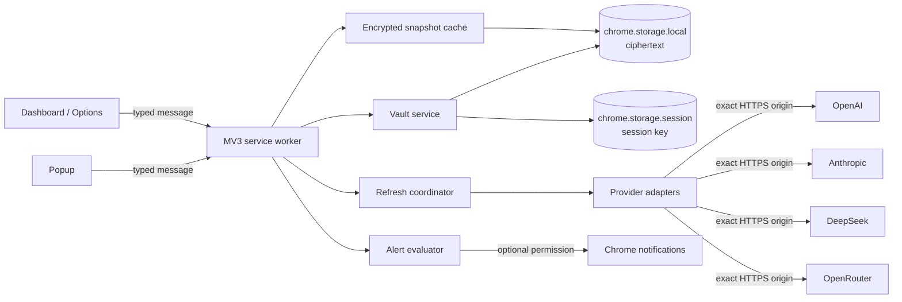
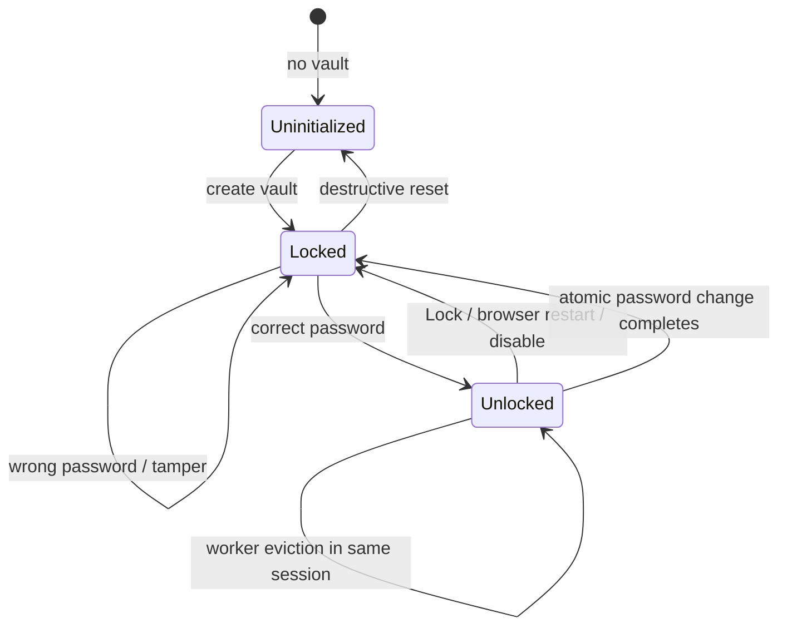
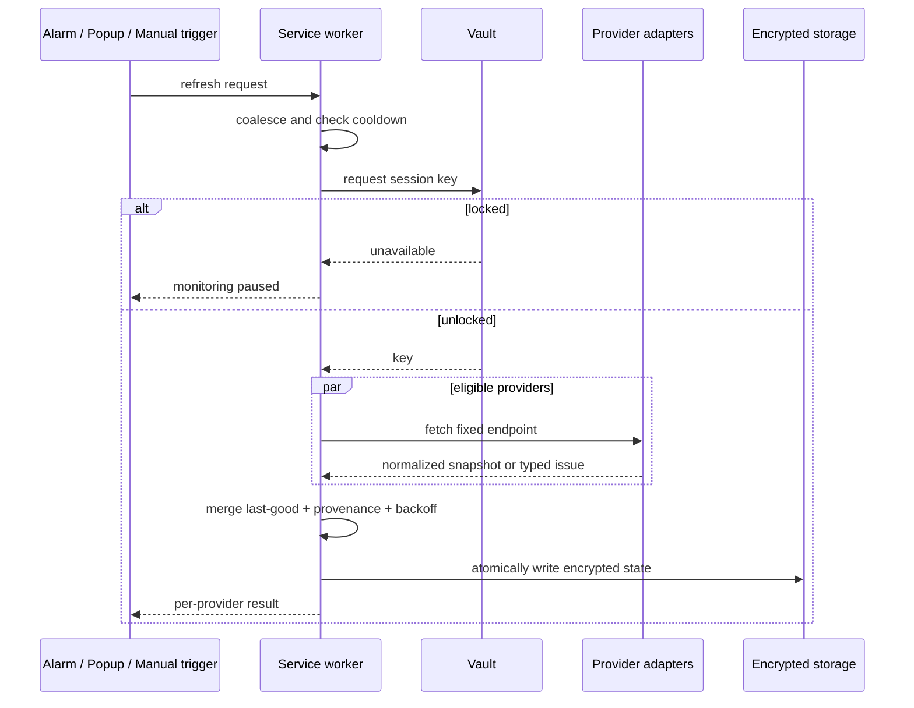

# Spender Chrome Extension

## Goal Capsule

**Objective:** A Chrome user can install Spender, securely connect supported LLM billing credentials, and monitor truthful spend or balance metrics without installing the macOS app or creating a Spender cloud account.

**Means:** Build an independent Manifest V3 extension that stores an encrypted local vault and calls provider reporting APIs directly from its service worker (KTD1–KTD4).

**Authority hierarchy:** This plan governs the Chrome extension. Existing Swift provider behavior and sanitized fixtures define metric semantics where this plan cites them. Current official Chrome and provider documentation overrides stale implementation assumptions. User-settled product decisions override convenience choices.

**Execution profile:** Deep, security-sensitive feature work. Implement units in dependency order. Keep the Swift application operational throughout.

**Stop conditions:** Stop and escalate if a provider's documented account-reporting endpoint cannot be called from an MV3 extension with the named credential; if Chrome Web Store policy requires broader data collection or permissions than this plan allows; or if a requested change would persist a decrypt key across browser restarts, introduce a backend, or collect browsing activity.

**Tail owner:** `ce-work` owns implementation, verification, atomic commits, and release preparation. Google owns the external review duration and final publication decision.

## Product Contract

### Summary

Add a standalone desktop Chrome extension under `chrome-extension/`. Its popup provides the fastest view of Today, Yesterday, and 30 Days. A full extension page owns onboarding, connections, detailed reporting, card customization, security, and notifications. Data goes directly from the extension to the selected provider APIs over HTTPS. Spender has no backend, analytics, account system, request proxy, or prompt collection.

### Problem Frame

The macOS application is useful only on a Mac and cannot be published in Chrome Web Store. A browser extension is easier for Chrome users to discover and install, but Chrome does not provide Keychain-equivalent secret storage or a permanently running background process. The design must therefore make local encryption, browser-session unlocking, service-worker eviction, partial provider coverage, and Store disclosure first-class behavior rather than hidden implementation details.

### Key Decisions

- **KD1 — session-settled: ship a standalone local extension.** It must not require the macOS application, native messaging, a backend, or a Spender account. Governs R1, R2, R4, R15.
- **KD2 — session-settled: optimize for the simplest end-user install.** Chrome Web Store install is one step; credential setup remains provider-specific because billing APIs require different credential types. Governs R3, R6, R10.
- **KD3 — call the product “periodic,” not “real-time.”** Chrome alarms are best effort and do not wake a closed or sleeping browser. Governs R8, R9, R11.
- **KD4 — truth beats visual parity.** Missing spend history is shown as unavailable, never as zero or reconstructed from unrelated lifetime values. Governs R6, R7, R12.
- **KD5 — release four providers first.** OpenAI, Anthropic, DeepSeek, and OpenRouter form the MVP; other providers remain deferred until their financial APIs pass the same feasibility gate. Governs R6, R16.

### Actors

- **Extension user:** creates and unlocks the vault, supplies provider credentials, reads metrics, controls notifications, and deletes data.
- **Chrome extension service worker:** is the only component that decrypts credentials and calls provider APIs.
- **Provider API:** returns official cost, usage, or balance data according to its own contract.
- **Chrome Web Store reviewer:** verifies single purpose, permissions, privacy disclosures, remote-code compliance, and listing assets.

### Requirements

#### Product boundary and privacy

- **R1 — Standalone install:** The extension works on desktop Chrome without the macOS app, native messaging, a backend, a Spender login, or a paid Spender service.
- **R2 — Local-only data path:** Credentials and financial snapshots remain in the selected Chrome profile. Network requests go only to the exact HTTPS origins of explicitly connected providers. The extension contains no analytics, telemetry, prompt capture, page inspection, or browsing-history collection.
- **R3 — Clear onboarding:** Before a credential is entered, the UI names the exact credential type, explains why an ordinary inference key may be insufficient, links to the official provider console, and states what metrics that connection can supply.
- **R4 — Complete deletion:** Deleting a provider removes its encrypted credential, financial snapshots, estimation checkpoints, and notification state. Reset Vault removes all extension data after destructive confirmation.

#### Vault and session security

- **R5 — Encrypted at rest:** Persistent Chrome storage contains only authenticated ciphertext and non-secret schema metadata for protected data. It never contains plaintext credentials, the master password, or a persistent decrypt key. `chrome.storage.sync` is not used for secrets or financial history.
- **R6 — Session unlock:** After each full Chrome restart, extension update/disable cycle, or manual Lock, the user must unlock the vault once. Until then, the UI says `Locked — unlock to refresh`, provider calls and notifications are paused, and cached financial values remain masked.
- **R7 — Safe vault lifecycle:** Wrong passwords and tampered envelopes fail closed. Change Password re-encrypts atomically. A forgotten password has no recovery path other than destructive Reset Vault, and onboarding explains this before vault creation.

#### Metrics and provider truthfulness

- **R8 — Supported periods:** The dashboard offers Today, Yesterday, and 30 Days with explicit last-updated time, reporting coverage, and provenance. Presentation uses the user's local timezone; provider request boundaries and stored buckets use UTC and are aggregated without overlap at timezone or DST boundaries.
- **R9 — OpenAI:** An Organization Admin API key retrieves official cost, token, and model usage from organization reporting endpoints. Pagination limits and incomplete coverage remain visible.
- **R10 — Anthropic:** A Console Admin API key retrieves official cost, token, and model usage. Priority Tier gaps or page limits mark coverage partial instead of inventing complete totals.
- **R11 — DeepSeek:** A standard API key retrieves official current balance. Estimated daily spend starts only after two balance observations, records positive balance decreases, ignores top-ups as negative spend, and is labeled `Estimated`.
- **R12 — OpenRouter:** A Management API key retrieves official remaining credits. It does not create Today, Yesterday, 30 Days, or chart sectors from lifetime `total_usage` unless a future documented period endpoint is implemented.
- **R13 — Honest aggregation:** Official and estimated values are never silently mixed. A mixed total is labeled `Official + estimated`; incomplete provider coverage is marked partial; unavailable metrics are omitted rather than converted to `$0.00`.

#### Refresh, user experience, and alerts

- **R14 — Best-effort refresh:** Manual refresh and popup-open refresh work while unlocked. A `chrome.alarms` schedule refreshes stale providers while Chrome is running. Concurrent triggers coalesce, providers fail independently, `Retry-After` and exponential backoff are respected, and the last good snapshot remains available as `Outdated`.
- **R15 — Focused UI:** The popup is a compact monitor. Connection forms, dashboard detail, customization, security, and notification settings live on a full extension page. Users can hide and reorder provider cards without deleting connections.
- **R16 — Optional notifications:** Notifications are off by default. Chrome asks for the optional permission only when the user enables alerts. Cost thresholds apply to providers with period spend; low-balance thresholds apply to balance providers. Events are deduplicated and re-armed after recovery, top-up, or a new reporting period.
- **R17 — Accessible interaction:** Onboarding, unlocking, period switching, refresh, connection management, customization, and security flows are keyboard complete, screen-reader labeled, not color-only, and usable with reduced motion and high contrast.

#### Distribution

- **R18 — Store-compliant package:** The production ZIP uses Manifest V3, has `manifest.json` at its root, bundles all executable code locally, declares no content scripts, and requests only `storage`, `alarms`, optional `notifications`, and exact optional provider origins.
- **R19 — Transparent publication:** A public Privacy Policy and Chrome Web Store disclosures describe authentication and financial data, local encryption, direct provider requests, retention/deletion, absence of backend/analytics, and support contact. The listing supplies required icons, screenshots, promotional image, single-purpose description, permission justifications, and Limited Use certification.
- **R20 — Independent maintenance:** Chrome code and builds remain isolated from the Xcode target. Domain behavior stays aligned through documented contracts and sanitized cross-platform fixtures, not through generated Swift/TypeScript shared runtime code.

### Key Flows

1. **First run:** Install → Welcome tab → local-only explanation → Create Vault → master password confirmation and no-recovery warning → select provider → credential guidance → grant exact host permission → test credential → encrypt and save → initial refresh → open dashboard.
2. **Returning session:** Open popup → Unlock → show decrypted cached snapshot → refresh stale providers → default to Today.
3. **Routine monitoring:** Select period → inspect aggregate provenance and provider cards → expand detail → open Billing or provider Dashboard when needed.
4. **Connection replacement:** Enter replacement in an ephemeral form → validate in worker memory → save ciphertext only after success or explicit save-with-warning choice → clear the form. The old credential remains until commit.
5. **Background refresh:** Alarm fires → worker checks session unlock → skips silently if locked → refreshes eligible providers independently → atomically stores encrypted results → evaluates deduplicated alerts.
6. **Recovery:** Offline, 401/403, 429, timeout, or malformed response keeps the last good metric and adds a specific action. It never deletes a credential automatically.
7. **Security:** Lock clears the session key immediately. Change Password atomically replaces the vault. Reset Vault deletes all extension data after confirmation.

### Acceptance Examples

- **AE1:** Given a fresh install, before the user connects a provider, the extension sends no provider or Spender network request.
- **AE2:** Given a populated vault and a full Chrome restart, opening the popup shows Unlock and no amount. No provider call occurs until unlock succeeds.
- **AE3:** Given a service-worker termination within the same browser session, the next event restores the session key from trusted `chrome.storage.session` and continues without another password prompt.
- **AE4:** Given a wrong password or modified ciphertext, unlock fails without changing storage and without revealing which provider credentials exist.
- **AE5:** Given OpenAI and Anthropic official buckets, Today total equals only intersecting complete buckets; token counts are never converted to money.
- **AE6:** Given the first DeepSeek balance observation, the card shows balance and no spend. Given a later decrease, it adds estimated spend. Given a top-up, it adds no negative spend.
- **AE7:** Given OpenRouter credits, the card shows Remaining balance but contributes no fake period spend or donut sector.
- **AE8:** Given one provider returns 429, other providers update, the failed provider keeps its last value as Outdated, and retry observes `Retry-After`.
- **AE9:** Given the user deletes Anthropic, its ciphertext, snapshots, alerts, and checkpoints disappear while all other providers remain intact.
- **AE10:** Given notifications are disabled, `notifications` permission is absent. Enabling alerts requests it at that moment and handles denial without breaking monitoring.
- **AE11:** Given keyboard-only or ChromeVox use, the user can create/unlock the vault, connect a provider, change period, refresh, inspect provenance, reorder cards, and delete data.
- **AE12:** Given the production ZIP, a static audit finds no remote executable code, broad host permission, content script, plaintext canary, source map containing secrets, or undeclared network origin.

### Success Criteria

- A new user can reach the first valid provider snapshot without installing anything beyond the Chrome Web Store item.
- All four MVP adapters pass fixture contract tests and at least one sanitized real-contract validation before public submission.
- Browser restart, forced worker eviction, offline, authentication failure, rate limiting, and vault corruption have tested recovery behavior.
- Chrome Web Store private-test review has no unresolved security, privacy, permission, or misleading-metrics blocker before public rollout.

### Scope Boundaries

**MVP includes:** Chrome desktop Manifest V3; OpenAI, Anthropic, DeepSeek, OpenRouter; encrypted local vault; popup and full dashboard; Today/Yesterday/30 Days where supported; last-good cache; hide/reorder; periodic/manual refresh; optional notifications; privacy and Store package.

**Deferred:** Qwen, Kimi, xAI, Mistral and other provider parity; Gemini and Perplexity; multiple accounts per provider; encrypted export/import; cross-device sync; localization beyond the first release language; forecasting and currency conversion; Edge, Firefox, Safari, and mobile.

**Explicitly out:** backend or hosted API proxy; account registration; native companion or native messaging; intercepting LLM requests; dashboard scraping, cookies, private endpoints, or content scripts; prompt or browsing collection; persistent auto-unlock; claims of real-time or complete reporting when an API cannot supply it.

### Dependencies and Resource Estimate

#### Engineering estimate

| Workstream | Developer days |
|---|---:|
| Feasibility, workspace, manifest, and provider-origin spikes | 3–5 |
| Encrypted vault and migrations | 4–6 |
| Domain model, HTTP boundary, and four provider adapters | 7–10 |
| Refresh, persistence, alarms, and notifications | 3–5 |
| Popup, dashboard, onboarding, and customization UI | 5–8 |
| E2E, security hardening, privacy, and Store preparation | 3–6 |
| **MVP total** | **25–40 developer days (about 200–320 hours)** |

One senior developer should expect about 5–8 calendar weeks plus Google review time. Product/design polish needs 2–4 focused days; security review needs 2–4 days; QA and Store submission need 3–5 days and can overlap the engineering total when one person owns all roles. Ongoing provider maintenance is estimated at 1–3 days per month. There is no planned hosting bill. Chrome Web Store requires the one-time registration fee shown in the developer dashboard.

Adding broader provider parity after the MVP is a separate 10–20 day tranche, conditional on each provider exposing a documented financial API suitable for a browser extension.

#### Toolchain policy

Use a separate npm workspace in `chrome-extension/` with a committed `package-lock.json`. Prefer zero runtime libraries: TypeScript, native DOM/CSS/SVG, Web Crypto, Fetch, and Chrome APIs are sufficient. Vite, TypeScript, Vitest, ESLint, and Puppeteer are development tools only. Any production runtime dependency, decimal library, hosted privacy service, or external analytics service requires explicit approval before installation.

## Planning Contract

### Key Technical Decisions

- **KTD1 — independent workspace:** Create `chrome-extension/` in the existing repository. It has its own build, tests, lockfile, and release ZIP. It never becomes an Xcode target. This implements KD1 and R1/R20.
- **KTD2 — MV3 event architecture:** Use a Manifest V3 service worker as the only network and credential owner. Popup and full pages send typed messages; they never receive a saved secret. Persistent state is the source of truth because the worker may stop at any time.
- **KTD3 — versioned local vault:** Derive a wrapping key with PBKDF2-SHA-256 using a random salt and versioned work factor. Encrypt each protected envelope with AES-GCM and a unique random IV. Persist ciphertext and KDF metadata in `chrome.storage.local`; keep the derived key only in trusted `chrome.storage.session` until Lock or browser restart.
- **KTD4 — protect financial cache too:** Encrypt provider credentials, financial snapshots, estimation checkpoints, and alert state in the vault. Persist only non-sensitive preferences and a coarse locked/freshness marker outside it. This makes the locked popup mask amounts consistently.
- **KTD5 — trusted storage boundary:** At startup, call `chrome.storage.local.setAccessLevel({accessLevel: 'TRUSTED_CONTEXTS'})` and set session storage to trusted contexts. Do not declare content scripts, externally connectable messaging, `tabs`, `cookies`, `webRequest`, or `scripting`.
- **KTD6 — optional exact origins:** Put each exact provider HTTPS origin in `optional_host_permissions`. Request it only when connecting that provider. Adapter code owns a fixed URL allowlist and rejects arbitrary message-supplied URLs and cross-origin redirects.
- **KTD7 — exact decimal strings:** Represent money as validated signed decimal strings plus ISO currency. Implement bounded, tested string/`BigInt` scale arithmetic in the domain layer rather than JavaScript `number`. Do not add a decimal runtime library without approval.
- **KTD8 — capability-driven provider model:** Port `ProviderSnapshot`, metric provenance, reporting coverage, provider capabilities, and normalized errors from Swift. UI renders only capabilities a provider actually supplies.
- **KTD9 — contract parity through fixtures:** Copy sanitized JSON fixtures and behavior cases into extension tests. Do not share runtime code or read Xcode resources at extension runtime.
- **KTD10 — periodic refresh state machine:** Recreate alarms on install/startup/wake, coalesce triggers, use per-provider cooldown, honor `Retry-After`, and cap exponential backoff. Refresh runs only while unlocked. Popup-open refreshes stale data; manual refresh remains available.
- **KTD11 — local production bundle:** Bundle every script, style, icon, and chart implementation in the ZIP. No CDN, remote imports, WebAssembly download, `eval`, `new Function`, or source-code interpretation is permitted.
- **KTD12 — staged publication:** Load and dogfood the production build unpacked, then submit the same release item to private trusted testers, resolve review feedback, and only then switch distribution to public.

### High-Level Technical Design

### Storage Contracts

- `vault-meta-v1`: schema version, KDF algorithm/work factor, salt, verifier, migration marker.
- `vault-data-v1`: authenticated encrypted credentials, snapshots, DeepSeek checkpoints, and notification state.
- `provider-customization-v1`: ordered provider IDs and hidden IDs; contains no financial values.
- `extension-settings-v1`: refresh preference, theme/accessibility preference, and notification toggle; no credentials.
- Whole-object replacement plus a migration journal provides atomic password changes and schema migrations. Unknown future schema blocks safely and offers reset rather than mutating ciphertext.

### Provider Contract Mapping

| Provider | Credential | Exact reporting behavior | MVP chart participation |
|---|---|---|---|
| OpenAI | Organization Admin API key | `/v1/organization/costs` and `/v1/organization/usage/completions`; independent pagination | Official period spend, tokens, models when coverage permits |
| Anthropic | Console Admin API key | `/v1/organizations/cost_report` and `/v1/organizations/usage_report/messages`; cursor pagination | Official period spend, tokens, models; partial when Priority Tier is uncovered |
| DeepSeek | Standard API key | `/user/balance`; local balance-delta estimator | Official balance; estimated spend labeled separately |
| OpenRouter | Management API key | `/api/v1/credits`; remaining is total credits minus lifetime usage | Balance card only; no period spend sector |

### Sequencing and Gates

1. **Feasibility gate:** prove vault session behavior under worker eviction and prove each exact provider call from an unpacked extension using local, non-committed credentials. A failed provider is removed from MVP rather than mocked as connected.
2. **Security/domain gate:** complete vault, exact decimal arithmetic, runtime validation, and leak tests before building connection UI.
3. **Data gate:** provider fixtures, refresh state machine, encrypted cache, and provenance tests pass before aggregate visualization.
4. **UX gate:** onboarding, popup, dashboard, customization, and alerts pass accessibility and error-state scenarios.
5. **Release gate:** final ZIP passes manifest/CSP/secret scans, browser resilience E2E, privacy review, and private tester feedback before public submission.

### System-Wide Impact

- Existing Swift code remains unchanged except optional shared documentation or sanitized fixture maintenance.
- Provider behavior now has two implementations. Contract fixtures and requirement-level parity tests are the drift-control mechanism.
- Chrome profiles and devices are intentionally isolated. There is no sync or migration from macOS Keychain.
- Provider reporting API changes can break one adapter without blocking the others. The UI must preserve this isolation.

### Risks and Mitigations

| Risk | Mitigation / release rule |
|---|---|
| Provider API accepts native requests but rejects extension-origin requests or requires unavailable billing scope | U1 executes real feasibility checks. Remove the provider from MVP if the documented path fails. |
| User expects seamless background refresh after Chrome restart | Onboarding and locked UI state the unlock requirement. Never persist the session key. |
| JS arithmetic changes financial totals | Use exact decimal-string arithmetic and cross-language golden fixtures. |
| Worker eviction loses in-memory work | Persist checkpoints, make handlers idempotent, and force termination between E2E steps. |
| Broad permissions delay or fail Store review | Optional exact origins, no content scripts, documented permission-to-feature mapping. |
| Secrets leak to storage, DOM, logs, errors, source maps, or fixtures | Canary scans, masked fields, ephemeral drafts, production bundle audit, no request/response logging. |
| DeepSeek estimator misreads top-up/refund/expiry | Estimate only positive decreases, retain provenance, expose observation coverage, and never claim billing reconciliation. |
| Store policy changes during implementation | Recheck official policy and listing requirements in U7 immediately before submission. |

### Sources and Research Breadcrumbs

#### Repository

- `LLMSpendMonitor/Domain/Money.swift` — currency invariants to port without floating-point arithmetic.
- `LLMSpendMonitor/Domain/ProviderSnapshot.swift` and `LLMSpendMonitor/Domain/ProviderCapability.swift` — capability, provenance, coverage, and validation semantics.
- `LLMSpendMonitor/Providers/ProviderClient.swift` and `LLMSpendMonitor/Providers/ProviderRegistry.swift` — provider contract and credential guidance.
- `LLMSpendMonitor/Providers/OpenAI/OpenAIProvider.swift`, `LLMSpendMonitor/Providers/Anthropic/AnthropicProvider.swift`, `LLMSpendMonitor/Providers/DeepSeek/DeepSeekProvider.swift`, `LLMSpendMonitor/Providers/OpenRouter/OpenRouterProvider.swift` — MVP endpoint behavior.
- `LLMSpendMonitor/Services/RefreshCoordinator.swift`, `LLMSpendMonitor/Services/RefreshBackoffPolicy.swift`, and `LLMSpendMonitor/Services/ProviderTargetFactory.swift` — refresh, estimation, and reporting-window behavior.
- `LLMSpendMonitor/Infrastructure/Networking/HTTPClient.swift` and `LLMSpendMonitor/Infrastructure/Persistence/SnapshotCache.swift` — origin, redirect, size, and schema constraints.
- `LLMSpendMonitorTests/Fixtures/` and provider/service/security tests — sanitized golden cases to mirror.

#### Official Chrome documentation

- [Extension service worker lifecycle](https://developer.chrome.com/docs/extensions/develop/concepts/service-workers/lifecycle)
- [`chrome.storage` API and access levels](https://developer.chrome.com/docs/extensions/reference/api/storage)
- [Extension privacy and user data](https://developer.chrome.com/docs/extensions/develop/security-privacy/user-privacy)
- [Cross-origin network requests](https://developer.chrome.com/docs/extensions/develop/concepts/network-requests)
- [`chrome.alarms`](https://developer.chrome.com/docs/extensions/reference/api/alarms) and [`chrome.notifications`](https://developer.chrome.com/docs/extensions/reference/api/notifications)
- [Manifest V3 migration and remote hosted code](https://developer.chrome.com/docs/extensions/develop/migrate/what-is-mv3)
- [Chrome Web Store user-data FAQ](https://developer.chrome.com/docs/webstore/program-policies/user-data-faq)
- [Prepare, publish, privacy, and review](https://developer.chrome.com/docs/webstore/prepare)
- [Puppeteer extension testing](https://developer.chrome.com/docs/extensions/how-to/test/puppeteer) and [service-worker termination testing](https://developer.chrome.com/docs/extensions/how-to/test/test-serviceworker-termination-with-puppeteer)

## Implementation Units

### U1. Feasibility spike and extension workspace

**Goal:** Prove the standalone architecture before product UI work and establish a reproducible MV3 build.

**Requirements:** R1–R3, R18, R20.

**Files:** `chrome-extension/package.json`, `chrome-extension/package-lock.json`, `chrome-extension/tsconfig.json`, `chrome-extension/vite.config.ts`, `chrome-extension/eslint.config.js`, `chrome-extension/manifest.json`, `chrome-extension/src/background/service-worker.ts`, `chrome-extension/src/shared/messages.ts`, `chrome-extension/scripts/package-extension.mjs`, `chrome-extension/tests/integration/provider-origin-feasibility.test.ts`, `.gitignore`.

**Approach:** Create the isolated npm workspace with TypeScript and a multi-entry MV3 build. Set `minimum_chrome_version` to 120. Declare `storage` and `alarms`; keep notifications and the four exact origins optional. Implement a minimal typed worker message path. With user-owned credentials supplied only through local ignored environment/input, validate the documented reporting request for each provider from an unpacked build. Validate that a value in trusted session storage survives worker termination but disappears after full browser restart. Record sanitized response shapes, origin list, status, and date in `docs/research/chrome-provider-feasibility.md`; never record credentials or raw financial values.

**Test scenarios:** ZIP root contains the manifest; unpacked extension loads without console errors; no provider call occurs before permission grant; denial is recoverable; each provider either passes with its exact credential or is explicitly removed from the MVP plan; forced worker termination preserves session state; full restart clears it.

**Verification:** `npm ci`, `npm run typecheck`, `npm run build`, `npm run package`, and the integration spike checklist pass. A human inspects `chrome://extensions` service-worker errors and the sanitized feasibility report.

**Dependencies:** None.

### U2. Domain model, HTTP boundary, and provider adapters

**Goal:** Produce truthful normalized snapshots for the four feasible providers without exposing credentials or losing decimal precision.

**Requirements:** R2, R8–R13, R20.

**Files:** `chrome-extension/src/domain/money.ts`, `chrome-extension/src/domain/provider.ts`, `chrome-extension/src/domain/snapshot.ts`, `chrome-extension/src/domain/errors.ts`, `chrome-extension/src/infrastructure/http-client.ts`, `chrome-extension/src/providers/registry.ts`, `chrome-extension/src/providers/openai.ts`, `chrome-extension/src/providers/anthropic.ts`, `chrome-extension/src/providers/deepseek.ts`, `chrome-extension/src/providers/openrouter.ts`, `chrome-extension/tests/fixtures/`, `chrome-extension/tests/unit/domain/`, `chrome-extension/tests/unit/providers/`.

**Approach:** Port the capability/provenance/coverage contracts and runtime invariants. Implement exact decimal-string arithmetic with bounded scale. Build fixed-origin adapters and a fetch wrapper with HTTPS-only URLs, request timeout, 2 MiB response limit, no cache/credentials, redacted errors, and cross-origin redirect rejection. Port pagination, page caps, tolerant decimal decoding, Anthropic minor-unit conversion, DeepSeek multi-currency rules, and OpenRouter balance calculation. Use fake HTTP queues and sanitized fixtures.

**Test scenarios:** exact decimal operations and ISO validation; path/query/header construction; independent pagination; page-cap partial coverage; scientific zero; malformed/oversized payload; timeout/offline/401/403/429 mapping; redirect rejection; multi-currency DeepSeek; OpenRouter never yields a period bucket; canary secret absent from errors and serialized snapshots.

**Verification:** `npm run test:unit -- domain providers` passes with branch coverage for every normalized error and provider capability.

**Dependencies:** U1.

### U3. Encrypted vault and persistent state

**Goal:** Store credentials and financial data safely across worker eviction and browser restarts while enforcing an explicit lock lifecycle.

**Requirements:** R4–R7, R15, R19.

**Files:** `chrome-extension/src/security/crypto-envelope.ts`, `chrome-extension/src/security/vault.ts`, `chrome-extension/src/security/vault-migrations.ts`, `chrome-extension/src/infrastructure/protected-store.ts`, `chrome-extension/src/infrastructure/preferences-store.ts`, `chrome-extension/src/shared/storage-schema.ts`, `chrome-extension/tests/unit/security/`, `chrome-extension/tests/integration/vault-lifecycle.test.ts`.

**Approach:** Implement PBKDF2-SHA-256 and AES-GCM with versioned parameters, random salt, and unique IVs. Restrict local and session storage access to trusted contexts. Encrypt credentials, snapshots, checkpoints, and alert state as one authenticated protected state. Implement create, unlock, lock, atomic password change, schema migration, provider delete, and destructive reset. UI messages receive presence/status only, never stored plaintext.

**Test scenarios:** round-trip; wrong password; tamper; IV uniqueness; worker eviction; full restart lock; manual lock; atomic password change interrupted before and after commit; unknown schema; provider delete isolation; reset; no plaintext canary in local/session storage, logs, errors, DOM-facing messages, or serialized fixtures.

**Verification:** `npm run test:unit -- security storage` and `npm run test:integration -- vault` pass; a raw storage inspection contains ciphertext but no canary.

**Dependencies:** U1, U2 domain types.

### U4. Refresh coordinator, encrypted cache, and alerts

**Goal:** Keep provider data fresh on a best-effort schedule without misreporting failures or repeatedly notifying users.

**Requirements:** R6, R8, R11–R16.

**Files:** `chrome-extension/src/services/refresh-coordinator.ts`, `chrome-extension/src/services/backoff-policy.ts`, `chrome-extension/src/services/deepseek-estimator.ts`, `chrome-extension/src/services/alert-evaluator.ts`, `chrome-extension/src/background/alarm-scheduler.ts`, `chrome-extension/src/background/service-worker.ts`, `chrome-extension/tests/unit/services/`, `chrome-extension/tests/integration/refresh-lifecycle.test.ts`.

**Approach:** Make the service worker own all refreshes. Recreate alarms on install/startup/wake. Coalesce concurrent requests, run eligible providers independently, persist encrypted last-good state, reject results from stale credential generations, and add typed issues without replacing valid metrics. Use per-provider cadence, exponential backoff with jitter, and `Retry-After`. Derive DeepSeek estimates from consecutive balance checkpoints inside a rolling 30-day UTC window. Ask for notifications permission only on opt-in; deduplicate and rearm alert thresholds.

**Test scenarios:** locked alarm performs no network call; concurrent triggers coalesce; one failure does not block others; last-good becomes Outdated; Retry-After and deterministic backoff; credential replacement rejects stale result; DeepSeek first point/decrease/top-up; missed alarm after sleep; permission denial; one-shot and rearmed alerts.

**Verification:** `npm run test:unit -- services` and `npm run test:integration -- refresh` pass under fake clock and deterministic jitter.

**Dependencies:** U2, U3.

### U5. Onboarding, popup, dashboard, and customization

**Goal:** Deliver the complete user-facing flow with compact monitoring and explicit security/provenance states.

**Requirements:** R3, R6–R17.

**Files:** `chrome-extension/src/ui/styles/`, `chrome-extension/src/ui/components/`, `chrome-extension/src/ui/onboarding/`, `chrome-extension/src/ui/popup/`, `chrome-extension/src/ui/dashboard/`, `chrome-extension/src/ui/options/`, `chrome-extension/public/icons/`, `chrome-extension/tests/unit/ui/`, `chrome-extension/tests/e2e/user-flows.test.ts`.

**Approach:** Build native TypeScript DOM components and local CSS/SVG, preserving the Spender visual language without a runtime UI framework. The popup defaults to Today and shows lock, freshness, aggregate provenance, and concise provider cards. The full page owns vault creation/unlock, Connections, Yesterday/30 Days detail, provider-specific guidance, Billing/Dashboard links, hide/reorder, Security, and Notifications. Mask secrets, use ephemeral drafts, and clear them on save/close. Make labels, focus order, announcements, contrast, and reduced motion explicit.

**Test scenarios:** first run; no-recovery acknowledgement; host permission grant/denial; connect/test/save; replace without losing old value on failure; unlock and immediate cached render; period totals and partial coverage; OpenRouter balance-only presentation; DeepSeek Estimated label; manual refresh; hide/reorder persistence; keyboard and ChromeVox paths; notification opt-in; delete and reset confirmations.

**Verification:** `npm run test:unit -- ui`, `npm run test:e2e -- user-flows`, automated accessibility checks, keyboard walkthrough, and visual inspection of popup plus full page in light/dark and high-contrast modes.

**Dependencies:** U3, U4.

### U6. Resilience, security audit, and production packaging

**Goal:** Prove the final production bundle survives MV3 lifecycle events and contains no secret, remote code, or undeclared capability.

**Requirements:** R2, R4–R7, R14, R17–R20.

**Files:** `chrome-extension/tests/e2e/resilience.test.ts`, `chrome-extension/tests/e2e/security.test.ts`, `chrome-extension/scripts/audit-bundle.mjs`, `chrome-extension/scripts/package-extension.mjs`, `chrome-extension/README.md`, root `README.md`, `.gitignore`.

**Approach:** Test the final unpacked production build with Puppeteer. Force service-worker termination between critical actions. Cover browser restart, sleep/wake, offline, auth errors, rate limits, 5xx, fetch timeout, corrupted storage, and extension upgrade/migration. Audit manifest permissions, CSP, remote URLs, source maps, dynamic evaluation, fixture/canary strings, and ZIP layout. Document local development and threat boundaries without documenting secrets.

**Test scenarios:** AE1–AE12 on the production build; restart is locked; same-session worker restart recovers; no network while locked; migration is atomic; all error classes remain provider-isolated; package scan is clean; unpacked load has no console error.

**Verification:** Full Verification Contract passes and `dist/spender-chrome-extension-<version>.zip` is reproducible from a clean checkout.

**Dependencies:** U1–U5.

### U7. Privacy, private test, and Chrome Web Store release

**Goal:** Submit an accurate, reviewable Store listing, validate with trusted users, and promote the same item to public distribution.

**Requirements:** R18–R20.

**Files:** `docs/chrome-extension/privacy-policy.md`, `docs/chrome-extension/store-listing.md`, `docs/chrome-extension/release-checklist.md`, `chrome-extension/store-assets/`, `chrome-extension/CHANGELOG.md`.

**Approach:** Publish the privacy policy at a stable public URL, preferably GitHub Pages from the repository unless the user approves a different host. Create the 128 px icon, at least one 1280×800 screenshot, 440×280 small promo image, and concise listing copy. Complete the single-purpose, data-use, permission, host, remote-code, and Limited Use declarations. Confirm developer 2-Step Verification and pay the one-time dashboard registration fee. Upload the production ZIP as a private trusted-test release, collect actionable feedback, fix blockers through new versioned uploads, then switch the same item to public distribution.

**Test scenarios:** every permission maps to a visible feature; policy matches runtime traffic and storage; screenshots match the shipped UI; install/update/uninstall work from the Store item; no duplicate beta listing; support and deletion instructions are reachable.

**Verification:** Release checklist is signed off, private testers report no launch blocker, the submitted ZIP matches the audited hash, and the item is accepted for the chosen distribution stage. Public acceptance remains an external Google gate.

**Dependencies:** U6.

## Verification Contract

Run all commands from `chrome-extension/` unless stated otherwise. U1 creates these scripts; later units may not weaken them without updating this plan's equivalent gate.

| Gate | Command | Covers | Pass condition |
|---|---|---|---|
| Clean install | `npm ci` | U1–U7 | Lockfile installs with no unresolved dependency or critical audit finding |
| Formatting/lint | `npm run lint` | U1–U7 | Exit 0; no ignored production directory |
| Type safety | `npm run typecheck` | U1–U7 | Exit 0 under strict TypeScript settings |
| Unit tests | `npm run test:unit` | U2–U5 | Domain, adapters, vault, refresh, alerts, and UI tests pass |
| Integration tests | `npm run test:integration` | U1, U3, U4 | Permission, vault lifecycle, storage, and refresh tests pass without live secrets |
| Production build | `npm run build` | U1–U7 | MV3 build completes with local assets only |
| Browser E2E | `npm run test:e2e` | U3–U7 | Final unpacked build passes user flow, forced worker termination, restart, failure, and accessibility cases |
| Bundle/security audit | `npm run audit:bundle` | U1–U7 | No remote code, broad permission, content script, dynamic evaluation, source-map secret, canary, or undeclared origin |
| Reproducible package | `npm run package` | U1, U6, U7 | Versioned ZIP has root manifest and stable contents from a clean checkout |
| macOS unit regression | `DEVELOPER_DIR=/Applications/Xcode.app/Contents/Developer xcodebuild -project ../LLMSpendMonitor.xcodeproj -scheme LLMSpendMonitor -destination 'platform=macOS' -derivedDataPath ../.build/DerivedData SWIFT_STRICT_CONCURRENCY=complete SWIFT_TREAT_WARNINGS_AS_ERRORS=YES test -only-testing:LLMSpendMonitorTests` | U2, U6 | Existing native domain/provider/service/security tests remain green |
| Manual browser review | Load final unpacked build in `chrome://extensions` | U1, U5–U7 | Popup, full page, permissions, lock/restart, light/dark, keyboard, and provider errors match the Product Contract with no console error |
| Store review checklist | Follow `docs/chrome-extension/release-checklist.md` | U7 | Policy, listing, assets, declarations, version, hash, privacy URL, and tester feedback are complete |

Live provider contract checks use developer-owned credentials outside source control. They are manual integration gates, not CI. Tests and logs must redact account IDs, costs, headers, bodies, and credentials. CI uses only sanitized fixtures.

## Definition of Done

### Global completion

- All requirements R1–R20 and acceptance examples AE1–AE12 are traced to passing units and verification evidence.
- The four MVP providers have passed the U1 feasibility gate. Any failed provider has been removed from registry, permissions, UI, listing copy, and MVP claims rather than represented by a stub.
- Persistent storage, logs, UI state, errors, test artifacts, build output, and ZIP contain no plaintext credential or canary.
- Full Chrome restart locks and masks financial data; same-session worker eviction recovers; manual Lock stops refresh immediately.
- Popup and full page expose only truthful capabilities, provenance, coverage, freshness, and provider-specific recovery actions.
- The final production ZIP loads without errors and passes lint, typecheck, unit, integration, E2E, bundle audit, package, accessibility, and native regression gates.
- Privacy Policy, Store disclosures, listing assets, and support/deletion instructions match actual behavior.
- Trusted tester blockers are resolved and the audited version is submitted to Chrome Web Store. Public availability is complete only after Google accepts it.
- Experimental, abandoned, duplicate, and debug-only code is removed. No live credential, feasibility output, local profile, or generated unpacked directory is committed.

### Per-unit completion

- **U1:** The MV3 workspace builds, packages, requests only exact optional origins, and documents a pass/fail feasibility result for every proposed MVP provider.
- **U2:** Normalized snapshots match sanitized provider fixtures with exact money arithmetic and fixed-origin network safety.
- **U3:** Vault lifecycle and migrations fail closed and leak no plaintext across storage, messages, logs, or interruption paths.
- **U4:** Refresh, estimation, last-good retention, cooldown, and alert deduplication pass deterministic lifecycle tests.
- **U5:** First-run through routine monitoring is usable, truthful, keyboard complete, and visually inspected in supported appearance modes.
- **U6:** The final bundle passes forced-eviction, restart, failure, security, CSP, manifest, and reproducibility audits.
- **U7:** Privacy, listing, assets, private-test feedback, release hash, and distribution status are documented and verifiable.

## Appendix

### Resource scenarios

- **Lean owner-built MVP:** One senior developer does product, design, QA, and submission sequentially: 5–8 weeks plus external review.
- **Two-person delivery:** One engineer plus part-time product/design/QA can compress elapsed time to about 4–6 weeks, but the engineering effort remains 25–40 developer days.
- **Full parity immediately:** Not recommended. It increases provider-contract and Store disclosure risk before the vault and lifecycle model are proven.

### Intentional security limitation

The vault protects credentials and financial data from casual reading of the Chrome profile at rest. It does not protect against a compromised operating system, compromised Chrome process, malicious extension build/update, keylogger, or memory inspection while unlocked. The Privacy Policy and security documentation must state this boundary without claiming hardware-backed protection.
