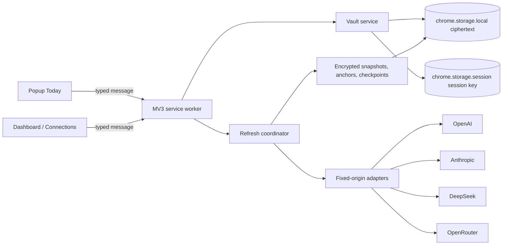

# Spender Chrome Extension

## Goal Capsule

**Objective:** A Chrome user can install Spender, securely connect supported LLM billing credentials, and monitor truthful spend or calibrated remaining-balance metrics without the macOS app or a Spender cloud account.

**Means:** Build an independent Manifest V3 extension. Its service worker calls provider reporting APIs directly and its encrypted local vault stores credentials and financial state (KTD1–KTD13).

**Authority hierarchy:** This plan governs the Chrome extension. Current official Chrome and provider documentation overrides stale implementation assumptions. Existing Swift behavior and canonical sanitized fixtures supply semantics only where this plan cites them; no Swift runtime is shared. User-settled decisions override convenience choices.

**Observable completion criterion:** A production MV3 ZIP, loaded unpacked from a clean checkout, completes the tested one-provider pilot, then all feasible MVP adapters; it keeps secrets encrypted and locked after restart, presents only correctly scoped UTC data or calibrated remaining balances, and passes the Verification Contract and Store checklist.

**Stop conditions:** Stop and escalate if a documented provider reporting endpoint cannot be called from MV3 with the named credential; Store policy requires broader data collection or permissions; the early pilot user gate rejects the connection experience; or a proposed change requires a persisted decrypt key, backend, FX conversion, browsing data, or notification state.

**Tail owner:** `ce-work` owns implementation, verification, atomic commits, and release preparation. Google owns external review duration and publication.

## Product Contract

### Summary

Add a standalone desktop Chrome extension under `chrome-extension/`. The popup is a compact **Today** monitor. The full extension page owns Yesterday, 30 Days, details, Connections, card customization, and security. Data goes over HTTPS directly from the extension to explicitly connected providers. There is no backend, analytics, account system, request proxy, prompt collection, or notification feature in v1.

### Key Decisions

- **KD1 — standalone local extension:** No macOS app, native messaging, backend, Spender account, or paid Spender service. Governs R1, R2, R4, R20.
- **KD2 — simplest install:** Store installation is one step. Credential setup remains provider-specific because reporting APIs need different credential types. Governs R3, R15.
- **KD3 — periodic, not real-time:** Alarms are best effort and do not wake closed or sleeping Chrome. Governs R14.
- **KD4 — truth before parity:** Missing, incompatible, or partial financial history is never zeroed, converted, proportionally split, or reconstructed from lifetime values. Governs R8–R13.
- **KD5 — four providers after feasibility:** OpenAI, Anthropic, DeepSeek, and OpenRouter are MVP candidates, not unconditional promises. Each must pass U1; a provider with no useful confirmed capability is removed from MVP. Governs R9–R12, R20.
- **KD6 — validate usability early:** After one feasible reporting provider works end-to-end, a user reviews the actual connection and first-value experience before the other adapters and broad UI are built. Governs U5.

### Actors and trust boundary

- **Extension user:** creates and unlocks the vault, supplies credentials, reads metrics, calibrates balances, customizes card order, and deletes local data.
- **Privileged extension contexts:** The service worker is the sole network and credential-operation owner. Popup and full extension pages never receive a saved credential, but remain trusted extension contexts: `chrome.storage.session` can be accessed by extension pages. They therefore receive the same strict CSP, sender validation, and injection hardening; this is not an untrusted-page boundary.
- **Provider API:** returns official cost, usage, or balance according to its documented contract.
- **Chrome Web Store reviewer:** verifies single purpose, permissions, privacy disclosures, locally bundled code, and listing assets.

### Requirements

#### Product boundary and privacy

- **R1 — Standalone install:** The extension works in desktop Chrome without the macOS app, native messaging, backend, Spender login, or paid Spender service.
- **R2 — Local-only data path:** Credentials and financial snapshots remain in the selected Chrome profile. Requests go only to exact HTTPS origins of explicitly connected providers. There is no analytics, telemetry, prompt capture, page inspection, or browsing-history collection.
- **R3 — Clear onboarding:** Before credential entry, the UI names the exact credential type, why an ordinary inference key may be insufficient, links to the official console, and states confirmed metrics and their limitations.
- **R4 — Complete deletion:** Provider deletion removes its encrypted credential, snapshots, checkpoints/calibrations, and exact optional host permission. Reset Vault removes all extension data and revokes all optional provider origins after destructive confirmation. A permission-revocation error does not block local deletion; the UI identifies the residual browser permission and recovery action. Local deletion does not revoke a provider-side key, so recovery links to provider rotation/revocation guidance.

#### Vault and session security

- **R5 — Encrypted at rest and ephemeral plaintext:** Persistent Chrome storage contains authenticated ciphertext and non-secret schema metadata only. It never contains plaintext credentials, master password, or a persistent decrypt key. A plaintext credential/password may exist in the user-entered ephemeral form and worker request needed to validate/save it. A saved credential may be decrypted only into service-worker memory for the duration of an authorized fixed-origin provider request. Neither kind is returned as a saved UI value, persisted, logged, placed in a diagnostic/canary, or retained after request completion/failure/abort, save, validation completion, close, Lock, Reset, or navigation; the worker explicitly clears its references. `chrome.storage.sync` is not used for secrets or financial history.
- **R6 — Session unlock:** After a full Chrome restart, extension update/disable cycle, or manual Lock, the user unlocks once. Until then, `Locked — unlock to refresh` is shown, provider calls are paused, and financial values are masked.
- **R7 — Safe vault lifecycle and races:** Wrong passwords and tampered envelopes fail closed. Password change is atomic. Lock, Reset Vault, provider delete, credential replacement, and Change Password cancel applicable in-flight requests, serialize state mutation, advance a generation, and invalidate late results. A late response must neither restore deleted/replaced data nor reveal or write a financial amount. A forgotten password can be recovered only by destructive Reset Vault; onboarding states this before creation.

#### Metric, currency, and interval truthfulness

- **R8 — UTC period contract:** v1 has one calculation timezone: UTC, visibly labeled on every Today, Yesterday, and 30 Days surface. `Today` is `[00:00:00Z of the current UTC date, now)`; `Yesterday` is the preceding complete `[00:00:00Z, 00:00:00Z)` day; `30 Days` is `[00:00:00Z of the UTC date 29 days before today, now)`, i.e. 30 UTC calendar dates including the current partial UTC day. Each value shows its actual half-open observed-coverage interval and last update. Only report buckets fully attributable to the requested interval can contribute; a bucket crossing an interval or calibration boundary is excluded and produces `Partial/Unavailable`, never a proportional split. A nominal current-day bucket such as `[today, tomorrow)` can contribute to Today only when U1 proves the provider's actual observed coverage ends at the request/report timestamp rather than at its nominal end; it is then `Provisional/Partial` and displays that proven observed end. Without that capability evidence, it is excluded. DST and local timezones do not alter calculations.
- **R9 — OpenAI official reporting and calibrated remaining balance:** An Organization Admin API key retrieves official cost, token, and model usage from confirmed organization reporting endpoints. It supports official UTC period spend where coverage permits. It may additionally show **Calibrated remaining balance** only after the user enters a source balance and confirms calibration: `entered balance − recomputed official cost anchors wholly after calibration`, per account scope and ISO currency. It is a derived estimate, never named or styled as a fetched official balance. Pagination limits, revisions, incomplete coverage, and the initial partly pre-calibration report bucket remain visible. That excluded initial gap remains Partial even when later anchors are complete, until the user recalibrates on a verifiable boundary or a confirmed finer-grained provider report covers it exactly.
- **R10 — Anthropic official reporting and calibrated remaining balance:** A Console Admin API key retrieves official cost, token, and model usage from confirmed reports. It supports official UTC period spend where coverage permits and the same user-calibrated remaining-balance model as R9. Priority Tier gaps, page limits, revised reports, incomplete coverage, and a partly pre-calibration initial bucket make the applicable value partial rather than precise. Later complete anchors do not erase that initial gap; only recalibration on a verifiable boundary or confirmed exact finer-grained reporting can do so.
- **R11 — DeepSeek observations:** A standard API key retrieves official current balance. Each estimate records its observation interval. A positive decrease is dated only if both observations fall in the same requested UTC day and the gap is within a calibrated maximum. A cross-boundary or long-gap decrease is `Unallocated estimate`, excluded from Today/Yesterday. It may appear in 30 Days only with `Partial` coverage **and only when its entire observation interval lies inside that selected 30-Day interval**; an interval crossing the 30-Day start/end is excluded with Partial coverage, never split. Top-ups never create negative spend; all derived values say `Estimated`. No artificial allocation across days is allowed.
- **R12 — OpenRouter balance only:** A Management API key retrieves official remaining credits. It does not create Today, Yesterday, 30 Days, or chart sectors from lifetime `total_usage` without a future documented period endpoint.
- **R13 — Honest aggregation:** Official and estimated values are never silently mixed; a mixed total says `Official + estimated`. Incomplete coverage is `Partial`; unavailable metrics are omitted rather than `$0.00`. Money aggregates only within one ISO currency; multiple currencies are displayed as separate totals and chart series or as `Multiple currencies`, never converted. Period spend, calibrated remaining balances, and provider-reported balances are separate metric families and are never added together.

#### Refresh and user experience

- **R14 — Best-effort refresh:** Manual and popup-open refresh work while unlocked. `chrome.alarms` refreshes stale providers only while Chrome runs. Concurrent triggers coalesce, providers fail independently, `Retry-After` and exponential backoff apply, and last-good data stays `Outdated`.
- **R15 — Focused UI:** The popup is a compact Today monitor with one primary `Open dashboard` action. The full page owns Yesterday/30 Days, detail, Connections, customization, security, calibration and provider links. Users can hide/reorder cards without deleting connections.
- **R16 — Notifications deferred:** v1 declares and requests no `notifications` permission and contains no alert, threshold, or notification state. Notifications are post-v1 and require a separate privacy/lifecycle decision.
- **R17 — Accessible interaction:** Onboarding, unlock, period switching, refresh, calibration, connection management, customization, and security flows are keyboard-complete, screen-reader labeled, not color-only, and usable with reduced motion/high contrast. Reordering has accessible `Move up`/`Move down` controls, retains focus, announces `name, position N of M`, and disables impossible boundary moves; drag-and-drop is optional only.

#### Distribution

- **R18 — Store-compliant package:** The production ZIP uses Manifest V3, has root `manifest.json`, bundles all executable code locally, declares no content scripts, and requests only `storage`, `alarms`, and exact optional provider origins.
- **R19 — Transparent publication:** Public Privacy Policy and Store disclosures describe authentication and financial data, local encryption, direct requests, UTC/partial reporting limitations, calibrated-balance derivation, retention/deletion, no backend/analytics, and support contact. Listing supplies required assets, single-purpose description, permission justifications, and Limited Use certification.
- **R20 — Independent maintenance:** Chrome code/builds remain isolated from Xcode. Behavioral alignment uses documented contracts plus canonical sanitized cross-platform fixtures, never shared generated/runtime code.

### Key flows

1. **First run:** Install → Welcome → local-only/no-recovery explanation → Create Vault → password confirmation → select provider → guidance → grant exact origin → validate credential → encrypt/save → initial refresh → dashboard.
2. **Returning session:** Open popup → Unlock → render decrypted cached state → refresh stale providers → Today in UTC.
3. **Calibrate OpenAI/Anthropic remaining:** After a successfully identified account scope, user enters a source balance and confirms its timestamp/currency → state saves `enteredBalance`, `synchronizedAt`, and no pre-calibration deduction → subsequent official report anchors are upserted and recomputed → UI shows `Calibrated remaining balance`, scope/currency, source timestamp, deduction coverage, and `Partial` where the initial report cannot be divided exactly. Recalibration/top-up replaces the checkpoint; it is not a provider-fetched balance.
4. **Routine monitoring:** Select UTC period in full page → inspect separate currency totals, provenance, coverage, and provider cards → detail or official Billing/Dashboard link.
5. **Credential replacement:** Hold the replacement in an ephemeral form → validate in worker memory → identify account scope → save ciphertext only after success/explicit warning → retain old credential until commit. Same provider but changed account scope starts a new data lineage: old scope snapshots and calibration cannot contribute and the user must calibrate again.
6. **Background refresh:** Alarm → worker verifies unlocked state/current generation → eligible adapters fetch fixed endpoints → normalized results are accepted only if account/credential/vault generation is still current → encrypted state atomically persists.
7. **Security mutation:** Lock, Reset, delete, or Change Password advances the relevant generation before clearing/replacing data and aborts pending requests. Late callbacks are discarded before any state/UI write.

### Acceptance examples

- **AE1:** Fresh install and no connection sends no provider or Spender request.
- **AE2:** After full Chrome restart, popup shows Unlock and no amount; no provider request occurs before success.
- **AE3:** Same-session worker termination restores only session key material from trusted `chrome.storage.session`; full browser restart clears it.
- **AE4:** Wrong password or modified ciphertext fails without storage mutation and without exposing credential presence.
- **AE5:** Every period label says UTC. At `2026-09-08T14:00:00Z`, Today is `[2026-09-08T00:00:00Z, 2026-09-08T14:00:00Z)`, Yesterday is `[2026-09-07T00:00:00Z, 2026-09-08T00:00:00Z)`, and 30 Days starts `2026-08-10T00:00:00Z`; no DST/local conversion occurs.
- **AE6:** A daily report bucket crossing a requested period boundary is excluded and status is Partial/Unavailable; it is never proportionally split or combined with an incompatible interval. A nominal current-day `[today, tomorrow)` bucket may show as Provisional/Partial Today only after U1 proves actual observed coverage through its stated report/request timestamp; UI displays that actual end, not the nominal tomorrow end. Otherwise it is excluded.
- **AE7:** First DeepSeek observation shows official balance and no spend; close same-UTC-day decrease produces dated Estimated spend; cross-midnight/long gap becomes Unallocated estimate; top-up does not create negative spend. An Unallocated interval crossing the selected 30-Day start or end is excluded with Partial coverage rather than contributing its full delta.
- **AE8:** OpenRouter credits show an official remaining-balance card but no period-spend sector.
- **AE9:** For a same-scope OpenAI/Anthropic calibration at an arbitrary time within a daily report bucket, the full overlapping bucket is not deducted. Only wholly post-calibration anchors count, and the excluded initial gap remains Partial despite later complete anchors until recalibration at a verifiable boundary or a confirmed exact finer-grained report covers it. It never calls the derived value `official balance`.
- **AE10:** A corrected/reissued official cost anchor with the same provider, account scope, report identity, interval, and currency replaces its old value; calibrated remaining is recomputed, not double-deducted. Replacing credentials with another account scope does not reuse the prior checkpoint or anchors.
- **AE11:** One provider returning 429 leaves other providers updated and its last value Outdated; retry follows `Retry-After`.
- **AE12:** Deleting Anthropic removes only its ciphertext, snapshots, anchors/checkpoint, and exact host permission. A permission-revocation failure is reported after successful local deletion.
- **AE13:** Keyboard-only/ChromeVox user can create/unlock, connect, calibrate, switch period, refresh, inspect provenance, move a card up/down, and delete data.
- **AE14:** Lock, Reset, provider delete, credential replacement, and Change Password each abort a deferred provider request; a response released afterward cannot render, persist, or restore its old metric.
- **AE15:** Production package has neither `notifications` permission nor alert settings/state.
- **AE16:** Static production audit finds no remote executable code, broad host permission, content script, plaintext canary, secret-bearing source map, or undeclared origin.

### Scope boundaries

**MVP includes:** Chrome desktop MV3; the four feasibility-passed candidates; encrypted local vault; popup Today; full UTC dashboard; official API-native reports; user-calibrated remaining balances for confirmed OpenAI/Anthropic scopes; DeepSeek observation estimates; OpenRouter balance; last-good cache; hide/reorder; periodic/manual refresh; privacy and Store package.

**Deferred:** notifications/thresholds; providers beyond MVP; multiple accounts per provider; export/import; cross-device sync; localization; forecasting; currency conversion; Edge, Firefox, Safari, and mobile.

**Explicitly out:** backend/proxy; account registration; native companion/messaging; interception of LLM requests; dashboard scraping/cookies/private endpoints/content scripts; prompt/browsing collection; persistent auto-unlock; generic migration framework/journal; real-time or complete-reporting claims unsupported by an API.

### Toolchain policy

`chrome-extension/` is a separate npm workspace with committed `package-lock.json`. Production uses native TypeScript DOM, CSS, SVG, Web Crypto, Fetch, and Chrome APIs; it does not use React or AI Elements. TypeScript, Vite, Vitest, ESLint, and Puppeteer are development tools. Any new production runtime dependency, including a decimal library, hosted privacy service, or analytics service, requires explicit approval.

## Planning Contract

### Technical decisions

- **KTD1 — independent workspace:** `chrome-extension/` has isolated build/tests/lockfile/release ZIP and is not an Xcode target.
- **KTD2 — MV3 ownership and honest boundary:** Service worker owns network and credential operations; typed UI messages receive status/derived view models only. Extension pages are trusted contexts, not a security boundary, so all extension UI follows strict CSP and injection rules.
- **KTD3 — vault cryptography:** PBKDF2-SHA-256 derives a 256-bit wrapping key from a random salt of at least 16 bytes. U1 benchmarks candidate work factors on the declared minimum supported hardware and records sanitized method/device class/result evidence; the selected versioned minimum work factor must produce approximately 250–500 ms and cannot be lowered automatically on a weaker device. Protected envelopes use AES-GCM with unique random 12-byte IVs. Ciphertext/KDF metadata are in `chrome.storage.local`; exportable session key material is in trusted `chrome.storage.session` only until Lock/restart. Creation rejects weak passwords; obsolete parameters upgrade only via the atomic generation protocol.
- **KTD4 — encrypted financial state and ephemeral plaintext:** Credentials, snapshots, report anchors, balance checkpoints, and calibrations are authenticated encrypted state. A connection form may hold user-entered credential/password text only while the user is acting on it; the worker may use that text solely for the associated validation/save request. For routine refresh it may decrypt a saved credential only into worker memory for the current authorized fixed-origin request, then clears its reference on completion, failure, abort, Lock, Reset, deletion, replacement, or error handling. Saved secrets are never sent back to UI. Only non-sensitive preferences and coarse locked/freshness markers are outside encrypted state.
- **KTD5 — fixed security controls:** At startup set local and session storage access level to `TRUSTED_CONTEXTS`. Use local-only CSP; forbid `innerHTML`, `outerHTML`, `insertAdjacentHTML`, dynamic scripts, and unsanitized URL sinks; render provider strings as text; validate sender and command allowlist. Do not declare content scripts, externally connectable messaging, `tabs`, `cookies`, `webRequest`, or `scripting`.
- **KTD6 — least origins and network boundary:** Each exact HTTPS provider origin is `optional_host_permissions`, requested only on connection. Adapter allowlists own URL/path construction and reject message-supplied URLs. Every provider request uses HTTPS, `credentials: 'omit'`, `cache: 'no-store'`, a finite `AbortController` timeout, a streamed 2 MiB response-body cap, and redirect rejection (including cross-origin redirects).
- **KTD7 — exact money:** Money is validated decimal string plus ISO currency; bounded `BigInt` scale arithmetic replaces `number`. No decimal runtime library without approval.
- **KTD8 — UTC, interval, and metric-family invariants:** Period calculations use R8 half-open UTC intervals. Aggregation requires compatible scope/currency/metric family and fully attributable report intervals. Provider-reported balances, calibrated remaining balances, official period spend, and estimates remain distinct.
- **KTD9 — calibrated remaining algorithm and report identity:** A calibration stores `enteredBalance`, `synchronizedAt`, ISO currency, provider identity, validated account scope, and any unresolved initial-coverage gap. A report anchor is keyed by stable `(provider, accountScope, report kind/dimensions, nominal [bucketStart,bucketEnd), currency)`; its actual observed `[coverageStart,coverageEnd)` and provisional/final provenance are separate fields. A newer response for the same key **replaces** that anchor (for example, a current-day provisional bucket becoming complete), never appends an overlapping second anchor. Aggregation rejects overlapping anchors for the same metric/dimension lineage and never combines a provider summary with dimensions that it already summarizes; it selects either the summary or a proven disjoint dimension set. On every refresh, deduction is recomputed from current anchors wholly within the eligible post-calibration interval; no refresh appends a deduction. An anchor overlapping calibration start or an incompatible period is excluded and creates/retains Partial coverage. Later complete anchors never erase that gap; only recalibration at a verifiable boundary or confirmed exact finer-grained coverage can resolve it. A changed account scope invalidates the old calibration and anchors. This is a local derived estimate, not fetched official balance.
- **KTD10 — versioned schema and atomic generations:** v1 fails closed for unknown schema versions and ships neither generic migration runner nor journal. Password change writes a complete candidate generation, read/decrypt-verifies it, then replaces one authoritative commit marker. Recovery keeps last committed generation, ignores incomplete candidates, and removes old data only after durable commit; each interruption point is tested.
- **KTD11 — cancellation and serial mutation:** Per-vault/provider credential generation plus `AbortController` make Lock, Reset, delete, replacement, and password change serial mutations. They invalidate before state change; completion must compare all relevant generations/account scope before state/UI write. Aborting is best-effort only; generation checks are the final guard.
- **KTD12 — canonical fixture parity:** `provider-contract-fixtures/` is one versioned, sanitized source. Swift and TypeScript test builds copy/generate their own test resources and CI verifies hash/version parity. No runtime component reads fixtures or shares runtime code.
- **KTD13 — local production bundle:** ZIP bundles scripts/styles/icons/charts locally; no CDN, remote imports, WebAssembly download, `eval`, `new Function`, or source interpretation.

### High-level design



```mermaid
sequenceDiagram
    participant T as Alarm / Popup / Manual
    participant W as Service worker
    participant V as Vault
    participant P as Provider adapter
    participant S as Encrypted storage
    T->>W: refresh(generation)
    W->>V: current session key + generation
    alt locked or stale
        V-->>W: unavailable
        W-->>T: monitoring paused
    else current
        W->>P: fixed endpoint (AbortSignal)
        P-->>W: normalized snapshot/anchor or issue
        W->>W: compare vault, credential, account generations
        alt still current
            W->>W: upsert anchors; recompute derived values
            W->>S: atomically write encrypted state
        else late
            W-->>T: discard with no state/UI write
        end
    end
```

### Storage and UI contracts

- `vault-meta-v1`: schema version, KDF algorithm/work factor, salt, verifier, authoritative generation marker.
- `vault-data-v1`: encrypted credentials, snapshots, report anchors, DeepSeek checkpoints, and OpenAI/Anthropic calibrations.
- `provider-customization-v1`: ordered and hidden provider IDs only.
- `extension-settings-v1`: refresh/theme/accessibility preferences only.
- No notification, alert, threshold, generic migration-journal, saved plaintext secret, or plaintext financial value exists in v1 storage. Ephemeral user-entry drafts are permitted only under R5/KTD4 and are not test canaries or diagnostics.

| Surface | Content | Period behavior | Primary transition |
|---|---|---|---|
| Popup | lock/freshness, Today UTC aggregate, concise visible cards, Refresh | Today only; UTC interval and provenance visible | `Open dashboard` |
| Full Dashboard | Yesterday/30 Days, currency-separated totals, coverage, details | UTC switcher; Partial/Unavailable instead of zero | Detail → Connections/Billing |
| Connections | credential guidance, tested capabilities, calibration, replace/delete | no aggregate | successful save → detail |
| Customize/Security | hide/show, Move up/down, Lock, password change, Reset | no period state | focus retained and position announced |

| State | Visible value | Status/action |
|---|---|---|
| Uninitialized/no connections | no amount | `Connect a provider` |
| Locked | all financial values masked | `Locked — unlock to refresh` / Unlock |
| Initial loading | skeleton, never `$0.00` | polite completion announcement |
| Refreshing | last good remains | duplicate refresh disabled |
| Fresh | current value | updated time + coverage/provenance |
| Partial/estimated | available portion only | explains excluded interval/estimate |
| Outdated | last good remains | cause and Retry |
| Unavailable capability | no value or chart sector | `Unavailable from this provider API`; optional provider documentation link |
| Auth / permission error | last good when present | credential-specific recovery: replace credential or provider-permission help |
| Rate limited | last good when present | `Outdated`, retry time from `Retry-After`/backoff |
| Offline / timeout / malformed / 5xx | last good when present | `Outdated`, distinct cause and retry action when eligible |

**State precedence:** `Locked` → mutation/security or auth/permission error → initial loading → refreshing → freshness/coverage. `Unavailable capability` is a terminal capability label, never an error. Rate-limit and transport/response failures retain their distinct cause alongside `Outdated`; coverage and provenance are orthogonal labels and remain visible. A mutation-in-progress masks/rejects its affected provider before a late result can surface.

### Provider mapping

| Provider | Credential | confirmed-candidate behavior | chart participation |
|---|---|---|---|
| OpenAI | Organization Admin API key | official organization cost/usage reports; same-scope calibrated remaining is derived from user entry and recomputed anchors | official period spend only |
| Anthropic | Console Admin API key | official cost/usage reports; same-scope calibrated remaining is derived from user entry and recomputed anchors | official period spend only |
| DeepSeek | Standard API key | official current balance plus interval observations | estimated spending only where R11 permits |
| OpenRouter | Management API key | official remaining credits | balance card only |

### Sequencing and gates

1. **Feasibility:** prove MV3 session behavior and every claimed provider endpoint/scope/range/boundary/capability from an unpacked extension with local non-committed credentials. Record pass/fail capability matrix. Remove unsupported capabilities/providers.
2. **Domain + pilot adapter:** establish exact money/UTC/calibration/cancellation contracts and one reporting provider with fixtures before generalized adapters.
3. **Vault:** prove encrypted lifecycle, fail-closed schema, atomic password generations, and mutation races before routine refresh.
4. **Refresh:** prove coalescing, cache, report-anchor upsert/recompute, backoff, scope guards, and DeepSeek intervals.
5. **Early user gate:** complete one provider's actual connection-to-meaningful-value flow; obtain user approval before remaining adapters/full UI.
6. **Release:** only the agreed product surface proceeds to remaining adapters, final UI, resilience, and Store work.

### Risks and mitigations

| Risk | Mitigation / release rule |
|---|---|
| Provider endpoint/scope rejects extension origin | U1 real feasibility; remove provider/capability if failed. |
| Arbitrary calibration falls inside aggregate report | Exclude overlap, mark partial, never infer a split; user may recalibrate on a report boundary. |
| Provider revises reporting values | Upsert anchored report identity and recompute, never append/deduct refresh deltas. |
| Credential change switches account | Validate scope; discard prior account lineage and require new calibration. |
| Worker callback races destructive action | Abort plus serialized generation/account checks; race E2E required. |
| User expects local-day or real-time values | UI says UTC and periodic; no local conversion/claim. |
| JS changes totals | Exact decimal strings plus canonical fixtures. |
| Secrets/injection leak | strict CSP/text-only tests, typed sender checks, canary scans, ephemeral drafts. |
| DeepSeek estimator misreads top-up/refund/expiry | bounded observations, explicit Unallocated estimate, no allocation. |
| Store policy drifts | recheck official policy in U8 before submission. |

### Sources and research breadcrumbs

#### Repository

- `LLMSpendMonitor/Domain/Money.swift`, `ProviderSnapshot.swift`, and `ProviderCapability.swift` — decimal, capability, provenance, coverage semantics.
- `LLMSpendMonitor/Providers/ProviderClient.swift`, `ProviderRegistry.swift`, and MVP provider implementations — candidate endpoint and credential guidance only.
- `LLMSpendMonitor/Infrastructure/Persistence/PlatformBalanceStore.swift` — native checkpoint precedent (`enteredBalance`, `synchronizedAt`, `deductedSpend`, anchors); Chrome follows this plan's recompute/scope rules rather than copying native limitations.
- `LLMSpendMonitor/Services/RefreshCoordinator.swift` and `RefreshBackoffPolicy.swift` — refresh/backoff precedent.
- `LLMSpendMonitorTests/Fixtures/` and provider/service/security tests — inputs for canonical sanitized cross-platform fixtures.

#### Official Chrome documentation

- [Extension service worker lifecycle](https://developer.chrome.com/docs/extensions/develop/concepts/service-workers/lifecycle)
- [`chrome.storage` API and access levels](https://developer.chrome.com/docs/extensions/reference/api/storage)
- [Extension privacy and user data](https://developer.chrome.com/docs/extensions/develop/security-privacy/user-privacy)
- [Cross-origin network requests](https://developer.chrome.com/docs/extensions/develop/concepts/network-requests)
- [`chrome.alarms`](https://developer.chrome.com/docs/extensions/reference/api/alarms)
- [Manifest V3 and remote hosted code](https://developer.chrome.com/docs/extensions/develop/migrate/what-is-mv3)
- [Chrome Web Store user-data FAQ](https://developer.chrome.com/docs/webstore/program-policies/user-data-faq)
- [Prepare, publish, privacy, and review](https://developer.chrome.com/docs/webstore/prepare)
- [Puppeteer extension and service-worker testing](https://developer.chrome.com/docs/extensions/how-to/test/puppeteer)

## Implementation Units

**`Files:` path base:** Unless marked `repo-root`, extension paths such as `package.json`, `package-lock.json`, `src/`, `tests/`, `public/`, `scripts/`, and extension `README.md` are relative to `chrome-extension/`; no package file belongs at repository root. `docs/`, `provider-contract-fixtures/`, repo-root `README.md`, and `.gitignore` are relative to repository root.

### U1. Feasibility and workspace

**Goal:** Prove the isolated MV3 architecture and exact feasible provider capability matrix before product work.

**Requirements:** R1–R3, R5–R6, R8–R12, R18, R20.

**Files:** `package.json`, `package-lock.json`, `tsconfig.json`, `vite.config.ts`, `eslint.config.js`, `manifest.json`, `src/background/service-worker.ts`, `src/shared/messages.ts`, `scripts/package-extension.mjs`, `tests/integration/provider-origin-feasibility.test.ts`; repo-root `docs/research/chrome-provider-feasibility.md`, `.gitignore`.

**Approach and acceptance:** Create isolated TypeScript MV3 build, `minimum_chrome_version: 120`, `storage`/`alarms`, exact optional provider origins, and no notifications. Benchmark PBKDF2 on declared minimum supported hardware, record sanitized device class/method/results and selected versioned minimum work factor, and pass only if it is approximately 250–500 ms without an automatic weaker-device downgrade. Using only local ignored user-owned credentials, validate every candidate endpoint, least-privileged scope, pagination, range, UTC granularity/boundary, actual observed-coverage semantics of current nominal buckets, account-scope identity availability, and metric from unpacked extension. Confirm trusted-session persistence across worker eviction and clearing at full restart. Sanitized matrix records pass/fail and confirmed subset; no raw values/credentials.

**Verification:** `npm ci`, typecheck, build, package, capability-matrix and KDF-benchmark evidence checklist, and human `chrome://extensions` worker inspection pass.

**Dependencies:** None.

### U2. Domain model and pilot adapter

**Goal:** Implement exact normalized financial contracts and one feasibility-passed reporting provider (OpenAI if it passes U1, otherwise Anthropic) without generalized adapter work.

**Requirements:** R2, R8–R10, R13, R20.

**Files:** `src/domain/money.ts`, `provider.ts`, `snapshot.ts`, `calibration.ts`, `interval.ts`, `errors.ts`, `src/infrastructure/http-client.ts`, `src/providers/registry.ts`, one pilot provider adapter, `provider-contract-fixtures/`, `tests/unit/domain/`, `tests/unit/providers/`.

**Approach and acceptance:** Implement exact decimal/ISO, half-open UTC intervals, KTD6 fixed-origin fetch safeguards (HTTPS, omitted credentials/no-store cache, finite timeout, 2 MiB cap, redirect rejection), redacted typed errors, stable nominal-bucket report identity with separate actual coverage/provisional fields, account-scope validation, calibrated remaining recomputation, and fixtures. A report overlapping arbitrary calibration creates a persistent unresolved gap; revision or expanded current-day coverage replaces its same-key anchor; changed scope rejects old lineage. No extension runtime reads fixture files.

**Verification:** domain/provider unit tests cover decimals, ISO, paths/headers, HTTPS-only/fixed-origin request options, omitted credentials/no-store cache, timeout, 2 MiB cap, pagination/page caps, malformed/oversized/redirect/error handling, calibration overlap/gap persistence, revision upsert, same-nominal-bucket provisional-to-final replacement, overlapping-anchor rejection, summary-plus-dimension double-count rejection, scope change, and text-only provider strings.

**Dependencies:** U1.

### U3. Vault

**Goal:** Protect credentials and all financial state with precise session and destructive-mutation lifecycle.

**Requirements:** R4–R7, R19.

**Files:** `src/security/crypto-envelope.ts`, `vault.ts`, `src/infrastructure/protected-store.ts`, `preferences-store.ts`, `src/shared/storage-schema.ts`, `messages.ts`, `src/background/service-worker.ts`, `tests/unit/security/`, `tests/integration/vault-lifecycle.test.ts`.

**Approach and acceptance:** Implement KTD3–KTD5/KTD10/KTD11. Use versioned schema fail-closed; do not create migration framework/journal. Implement generation candidate → decrypt verification → authoritative marker for password change. Sender-validated worker handlers own create/unlock/lock/test/save/replace/delete/reset. Delete/reset revoke exact origins but report revocation failure separately. Abort and invalidate early on every destructive mutation.

**Verification:** security/storage integration tests cover wrong password, tamper, IV uniqueness, restart/update/disable/manual lock, all password-change interruption points, unknown schema, permission deletion/revocation failure, no canary in storage/logs/returned messages, ephemeral-draft clearing at every R5 boundary, CSP ban/text-only sinks, and late-response races.

**Dependencies:** U1, U2 types.

### U4. Refresh, encrypted cache, and reports

**Goal:** Refresh the pilot truthfully, preserve last good data, and make report corrections/races deterministic.

**Requirements:** R6–R14.

**Files:** `src/services/refresh-coordinator.ts`, `backoff-policy.ts`, `deepseek-estimator.ts`, `src/background/alarm-scheduler.ts`, `service-worker.ts`, `tests/unit/services/`, `tests/integration/refresh-lifecycle.test.ts`.

**Approach and acceptance:** Worker coalesces triggers, uses provider cooldown/backoff/`Retry-After`, retains Outdated last-good state, replaces same-key report anchors rather than appending overlap, recomputes pilot calibrated balance, and guards each result by vault/credential/account generation. Implement DeepSeek interval contract though adapter arrives in U6. No alert evaluator, notification permission, or notification state.

**Verification:** fake-clock tests cover locked no-network, coalescing, independent failure, last-good, backoff, report revision/current-day provisional-to-final replacement recomputation/no double deduction, initial calibration partial/gap persistence, overlapping-summary/dimension rejection, stale credential/scope result, cancellation after Lock/Reset/delete/password change, and DeepSeek first/decrease/top-up/unallocated including 30-Day-boundary exclusion logic.

**Dependencies:** U2, U3.

### U5. Pilot UI and early user gate

**Goal:** Deliver one provider's usable connection-to-meaningful-value flow and validate simplicity with the user before expanding scope.

**Requirements:** R3, R6–R10, R13–R17.

**Files:** `src/ui/styles/`, `components/`, `onboarding/`, `popup/`, minimal `dashboard/` and `connections/`, `public/icons/`, `tests/unit/ui/`, `tests/e2e/pilot-user-flow.test.ts`.

**Approach and acceptance:** Build native DOM/CSS/SVG flow for vault creation/unlock, pilot connection, exact permission, capability/UTC/coverage display, manual calibration, compact Today popup, and full-page detail. Include visible distinction between official spend, Calibrated remaining balance, and partial initial bucket. Enforce keyboard and text-only rendering. Conduct a structured user walkthrough: install → create/unlock → find correct credential → grant origin → test/save → first truthful value → understand coverage/recovery. Continue only on explicit approval or documented corrections; do not build remaining adapters/full dashboard first.

**Verification:** pilot E2E/accessibility/visual browser review and recorded user-gate outcome meet acceptance. If rejected, return to the smallest preceding unit needed to resolve it.

**Dependencies:** U3, U4.

### U6. Remaining adapters and full UI

**Goal:** Add feasibility-passed remaining providers and complete dashboard/customization without weakening the pilot contract.

**Requirements:** R8–R17, R20.

**Files:** remaining `src/providers/` adapters, `src/ui/dashboard/`, `options/`, provider detail components, `tests/fixtures/`, `tests/unit/providers/`, `tests/unit/ui/`, `tests/e2e/user-flows.test.ts`.

**Approach and acceptance:** Add the unbuilt OpenAI/Anthropic peer, DeepSeek, and OpenRouter only for U1-confirmed capability subsets. Complete Yesterday/30 Days UTC views, per-currency separation, provider cards, hide/show/reorder, Move up/down announcements, and details. Preserve balance/period/calibrated/estimate separation; do not add notifications.

**Verification:** fixture, UI, E2E, keyboard/ChromeVox, and visual tests cover all AEs for supported providers, hidden/reordered cards, multiple currencies, partial intervals, OpenRouter balance-only, and DeepSeek unallocated estimate.

**Dependencies:** U5 approved early user gate.

### U7. Resilience and production package

**Goal:** Prove final bundle security and MV3 lifecycle correctness, especially destructive-action races.

**Requirements:** R2, R4–R8, R13–R18, R20.

**Files:** `tests/e2e/resilience.test.ts`, `tests/e2e/security.test.ts`, `scripts/audit-bundle.mjs`, `scripts/package-extension.mjs`, `README.md` (extension); repo-root `README.md`, `.gitignore`.

**Approach and acceptance:** Puppeteer tests final unpacked build through worker termination, restart, sleep/wake, offline/auth/429/5xx/timeout, corrupt storage, update/disable-enable, and every late response after Lock/Reset/delete/replacement/password change. Audit manifest, CSP, text-only sinks/provider strings, remote URLs, source maps, dynamic evaluation, fixture/canary strings, exact origins, and ZIP layout.

**Verification:** full Verification Contract (except Store external gates) passes, package is reproducible from clean checkout, and no locked view shows financial amount or makes provider call.

**Dependencies:** U6.

### U8. Privacy, private test, and Store

**Goal:** Submit an accurate reviewable listing after implementation evidence is complete.

**Requirements:** R18–R20.

**Files:** repo-root `docs/chrome-extension/privacy-policy.md`, `docs/chrome-extension/store-listing.md`, `docs/chrome-extension/release-checklist.md`; `store-assets/`, `CHANGELOG.md` (extension).

**Approach and acceptance:** Publish policy at user-approved stable URL. Produce required icons/screenshots/promo image/listing and declarations matching actual local storage, direct origins, UTC limitations, calibrated-balance derivation, and deletion semantics. Upload audited ZIP to private trusted test, resolve blockers with new versioned uploads, then submit same item publicly. No notification disclosure because the feature is absent.

**Verification:** signed checklist maps every permission to visible feature; policy/screenshots match shipped behavior; Store install/update/uninstall works; submitted ZIP hash equals audited artifact. Google acceptance is external.

**Dependencies:** U7.

## Verification Contract

Run from `chrome-extension/` unless noted. U1 creates scripts; later units may not weaken equivalent gates.

| Gate | Command / evidence | Covers | Pass condition |
|---|---|---|---|
| Clean install | `npm ci` | U1–U8 | lockfile installs without unresolved dependency/critical audit finding |
| Lint | `npm run lint` | U1–U8 | exit 0; no ignored production directory |
| Type safety | `npm run typecheck` | U1–U8 | strict TypeScript exit 0 |
| Unit | `npm run test:unit` | U2–U6 | domain/adapters/vault/refresh/UI pass, including anchors and races |
| Integration | `npm run test:integration` | U1–U4 | feasibility/vault/storage/refresh pass without live secrets |
| Production build | `npm run build` | U1–U8 | MV3 build with local assets only |
| Browser E2E | `npm run test:e2e` | U3–U7 | user flow, worker/restart, failures, destructive races, accessibility pass |
| Bundle audit | `npm run audit:bundle` | U1–U8 | no remote code, broad permission, content script, dynamic eval, source-map saved secret or canary, undeclared origin, or notifications permission/state |
| Package | `npm run package` | U1, U7–U8 | reproducible versioned ZIP with root manifest |
| Native regression | `DEVELOPER_DIR=/Applications/Xcode.app/Contents/Developer xcodebuild -project ../LLMSpendMonitor.xcodeproj -scheme LLMSpendMonitor -destination 'platform=macOS' -derivedDataPath ../.build/DerivedData SWIFT_STRICT_CONCURRENCY=complete SWIFT_TREAT_WARNINGS_AS_ERRORS=YES test -only-testing:LLMSpendMonitorTests` | U2, U7 | existing native tests remain green |
| Manual browser review | final unpacked build in `chrome://extensions` | U1, U5–U8 | popup/full page/permissions/lock/UTC labels/keyboard/provider errors match contract |
| Early user gate | recorded U5 walkthrough | U5 | user approves simple connection and first-value experience, or corrections are resolved |
| Store checklist | `docs/chrome-extension/release-checklist.md` | U8 | policy/listing/assets/declarations/hash/privacy URL/tester feedback complete |

Live provider checks use developer-owned credentials outside source control. They are manual gates, not CI; tests/logs redact account IDs, costs, headers, bodies, and credentials. CI uses canonical sanitized fixtures only.

## Definition of Done

### Global

- R1–R20 and AE1–AE16 trace to passing implementation evidence.
- Every MVP provider has U1-confirmed useful capability; failed providers/capabilities are removed from registry, permissions, UI, listing, and claims.
- U5 early user gate approved the one-provider flow before U6 began.
- Persistent storage, logs, returned UI view models, errors, test artifacts, build output, and ZIP contain no plaintext saved credential or canary. The only permitted UI plaintext secret is the user-entered short-lived connection/password draft defined by R5/KTD4; it is cleared at every stated lifecycle boundary and is never used as a test canary or logged.
- Restart/update/disable-enable lock/mask values; same-session eviction recovers; every destructive mutation cancels/invalidates late results.
- All UTC period totals use compatible fully attributable intervals; no FX or incompatible metric-family aggregation. Calibrated balances are derived, scoped, recomputed on report revision, and transparently partial where an arbitrary calibration cannot be exactly separated.
- Final ZIP passes lint, typecheck, unit, integration, E2E, bundle audit, package, accessibility, visual/manual browser review, and native regression.
- Policy, disclosures, assets, and support/deletion copy match actual behavior. Trusted-test blockers are resolved and audited artifact is submitted; public release awaits Google.

### Per-unit

- **U1:** Workspace packages and documents pass/fail capability matrix with exact origins and no notifications.
- **U2:** Pilot provider/domain honors money, UTC, anchor/revision, scope, calibration, and fixture contracts.
- **U3:** Vault fails closed, password generation recovers atomically, and mutations do not leak or revive state.
- **U4:** Refresh/cache/backoff/upsert/recompute/DeepSeek interval behavior is deterministic.
- **U5:** One provider flow is accessible, truthful, visually inspected, and user-approved.
- **U6:** Remaining confirmed adapters and full UI preserve all metric/state/accessibility contracts.
- **U7:** Production bundle passes lifecycle, race, CSP/text-only, manifest, secret, and reproducibility audit.
- **U8:** Privacy/listing/assets/private test/hash/distribution evidence is complete.

## Estimate and intentional limitations

| Workstream | Developer days |
|---|---:|
| U1 feasibility/workspace | 3–5 |
| U2 domain and pilot adapter | 4–6 |
| U3 vault | 4–6 |
| U4 refresh/cache | 3–5 |
| U5 pilot UI and user gate | 4–6 |
| U6 remaining adapters/full UI | 5–8 |
| U7 resilience/package | 3–5 |
| U8 privacy/Store | 3–5 |
| **MVP total** | **29–46 developer days (about 232–368 hours)** |

This is a **revised planning estimate**, not observed delivery duration: it increases the prior plan for calibrated-balance scope/recompute, the U5 early user gate, and destructive-action race/security coverage. One senior developer should expect roughly 6–9 calendar weeks plus Google review. Broader provider parity is a separate 10–20 day tranche after a new feasibility review.

The vault protects at-rest profile data from casual reading. It does not protect against a compromised OS/Chrome process, malicious extension build/update, keylogger, or unlocked-memory inspection. The policy must state this without claiming hardware-backed protection.
